# Olympic Learning Platform — Phase 2 Domain Analysis

## 1. Document Information

| Field         | Value                                                                                                                                                             |
| ------------- | ----------------------------------------------------------------------------------------------------------------------------------------------------------------- |
| Project name  | Olympic Learning Platform                                                                                                                                         |
| Phase         | Phase 2 — Domain Analysis                                                                                                                                         |
| Status        | Final baseline                                                                                                                                                    |
| Based on      | Phase 0 — Project Initiation, Phase 1 — Requirements Engineering                                                                                                  |
| Purpose       | Phân tích nghiệp vụ, thống nhất glossary, domain model, business rules, domain events, state diagrams và core workflows trước khi sang thiết kế hệ thống chi tiết |
| Main question | Nghiệp vụ có những khái niệm nào và chúng liên hệ với nhau ra sao?                                                                                                |

---

## 2. Phase 2 Goal

Phase 2 trả lời câu hỏi:

> Nghiệp vụ của Olympic Learning Platform gồm những khái niệm nào, trạng thái nào, rule nào và workflow chính nào?

Phase này chưa tập trung vào database, API hay UI chi tiết. Mục tiêu chính là hiểu domain — tức miền nghiệp vụ của hệ thống.

Các artifact trong Phase 2:

```text id="ia2c5h"
2.1 Glossary
2.2 Domain Model
2.3 Business Rules
2.4 Domain Events
2.5 State Diagrams
2.6 Core Workflows
```

---

## 3. Scope of Phase 2

Phase 2 tập trung vào các domain chính:

* User & Permission Domain
* Learning Content Domain
* Question Bank Domain
* Assessment Domain
* Attempt & Submission Domain
* Grading Domain
* Result Domain
* Contribution Domain
* Screening Domain
* File/Attachment Domain

---

## 4. Glossary

## 4.1. User & Permission Terms

| Term            | Vietnamese Meaning      | Definition                                                                                           |
| --------------- | ----------------------- | ---------------------------------------------------------------------------------------------------- |
| User            | Người dùng              | Tài khoản sử dụng hệ thống. User có thể là student, teacher, admin, BTC hoặc contributor.            |
| Student         | Sinh viên               | Người học sử dụng hệ thống để ôn luyện, làm bài, xem kết quả và theo dõi lịch sử học tập.            |
| Teacher         | Giảng viên              | Người tạo câu hỏi, tạo bài luyện tập, giao bài, chấm tự luận và theo dõi kết quả sinh viên.          |
| Admin           | Quản trị viên           | Người quản lý user, role, permission, subject, topic và dữ liệu hệ thống.                            |
| BTC / Organizer | Ban tổ chức             | Nhóm người sử dụng kết quả hệ thống để tham khảo khi tổ chức hoặc sàng lọc Olympic nội bộ.           |
| Contributor     | Người đóng góp nội dung | Student được cấp thêm permission để đề xuất câu hỏi, lời giải hoặc tài liệu.                         |
| Role            | Vai trò                 | Nhóm quyền chính của user, ví dụ Student, Teacher, Admin, BTC.                                       |
| Permission      | Quyền cụ thể            | Quyền thao tác cụ thể trong hệ thống, ví dụ `QUESTION_CREATE`, `QUESTION_CONTRIBUTE`, `ESSAY_GRADE`. |

---

## 4.2. Learning Content Terms

| Term              | Vietnamese Meaning | Definition                                                                             |
| ----------------- | ------------------ | -------------------------------------------------------------------------------------- |
| Subject           | Môn học            | Môn Olympic hoặc nhóm kiến thức chính, ví dụ Toán, Vật lý, Hóa học, Tin học.           |
| Topic             | Chuyên đề          | Nhánh nhỏ thuộc một subject, ví dụ Đại số, Giải tích, Cơ học, Điện học.                |
| Learning Material | Tài liệu học tập   | Nội dung hỗ trợ học tập như PDF, Word, ảnh, ghi chú, lời giải hoặc tài liệu tham khảo. |
| Attachment        | Tệp đính kèm       | File được gắn vào câu hỏi, lời giải hoặc tài liệu học tập.                             |
| Explanation       | Lời giải           | Nội dung giải thích đáp án hoặc cách làm của một câu hỏi.                              |
| Rubric            | Hướng dẫn chấm     | Tiêu chí chấm điểm cho câu hỏi tự luận.                                                |

---

## 4.3. Question Bank Terms

| Term                     | Vietnamese Meaning        | Definition                                                                                |
| ------------------------ | ------------------------- | ----------------------------------------------------------------------------------------- |
| Question                 | Câu hỏi                   | Đơn vị nội dung chính dùng trong bài luyện tập hoặc bài sàng lọc.                         |
| Question Type            | Loại câu hỏi              | Kiểu câu hỏi, gồm Single Choice, Multiple Choice và Essay trong MVP.                      |
| Single Choice Question   | Câu hỏi chọn một đáp án   | Câu hỏi trắc nghiệm chỉ có một đáp án đúng.                                               |
| Multiple Choice Question | Câu hỏi chọn nhiều đáp án | Câu hỏi trắc nghiệm có thể có nhiều đáp án đúng.                                          |
| Essay Question           | Câu hỏi tự luận           | Câu hỏi yêu cầu student nhập câu trả lời dạng văn bản và cần teacher/admin chấm thủ công. |
| Question Option          | Phương án trả lời         | Một lựa chọn trong câu hỏi trắc nghiệm.                                                   |
| Correct Option           | Đáp án đúng               | Option được đánh dấu là đúng.                                                             |
| Point                    | Điểm câu hỏi              | Số điểm tối đa của một câu hỏi.                                                           |
| Difficulty               | Độ khó                    | Mức độ khó của câu hỏi, ví dụ Easy, Medium, Hard.                                         |
| Question Status          | Trạng thái câu hỏi        | Trạng thái vòng đời của câu hỏi, ví dụ Draft, Published, Archived.                        |

---

## 4.4. Assessment Terms

| Term                 | Vietnamese Meaning     | Definition                                                                                                            |
| -------------------- | ---------------------- | --------------------------------------------------------------------------------------------------------------------- |
| Assessment           | Bài đánh giá / bài làm | Khái niệm chung chỉ một tập câu hỏi được dùng để student làm. Assessment có thể là Practice Set hoặc Screening Event. |
| Practice Set         | Bài luyện tập          | Assessment dùng cho mục đích ôn luyện cá nhân.                                                                        |
| Screening Event      | Đợt sàng lọc           | Assessment dùng cho mục đích tham khảo năng lực sinh viên trong hoạt động Olympic nội bộ.                             |
| Assessment Question  | Câu hỏi trong bài      | Quan hệ giữa một assessment và một question, có thể chứa thứ tự, điểm override hoặc cấu hình hiển thị.                |
| Published Assessment | Bài đã công bố         | Assessment đã sẵn sàng để student nhìn thấy và làm.                                                                   |
| Draft Assessment     | Bài nháp               | Assessment đang được tạo, student chưa nhìn thấy.                                                                     |

---

## 4.5. Attempt, Submission & Result Terms

| Term           | Vietnamese Meaning         | Definition                                                                             |
| -------------- | -------------------------- | -------------------------------------------------------------------------------------- |
| Attempt        | Lượt làm bài               | Một lần student bắt đầu làm một assessment.                                            |
| Attempt Answer | Câu trả lời trong lượt làm | Câu trả lời của student cho một question trong attempt.                                |
| Submission     | Bài nộp                    | Attempt đã được student submit.                                                        |
| Auto Grading   | Chấm tự động               | Hệ thống tự động tính điểm cho câu hỏi trắc nghiệm.                                    |
| Manual Grading | Chấm thủ công              | Teacher/admin nhập điểm và nhận xét cho câu hỏi tự luận.                               |
| Result         | Kết quả bài làm            | Tổng hợp điểm trắc nghiệm, điểm tự luận, tổng điểm và trạng thái chấm.                 |
| Total Score    | Tổng điểm                  | Tổng điểm cuối cùng của attempt sau khi tính điểm trắc nghiệm và điểm tự luận đã chấm. |
| Grading Status | Trạng thái chấm            | Trạng thái như Submitted, Partially Graded, Graded.                                    |

---

## 4.6. Contribution Terms

| Term                 | Vietnamese Meaning | Definition                                                       |
| -------------------- | ------------------ | ---------------------------------------------------------------- |
| Contribution Request | Yêu cầu đóng góp   | Nội dung do contributor gửi lên để teacher/admin review.         |
| Pending Review       | Chờ duyệt          | Trạng thái nội dung đang chờ teacher/admin xem xét.              |
| Approved             | Đã duyệt           | Nội dung đã được duyệt.                                          |
| Rejected             | Bị từ chối         | Nội dung không được chấp nhận.                                   |
| Published            | Đã công bố         | Nội dung đã được đưa vào sử dụng chính thức.                     |
| Archived             | Lưu trữ            | Nội dung không còn sử dụng nhưng vẫn được giữ lại để tham chiếu. |

---

# 5. Domain Model

## 5.1. Domain Model Overview

Domain model mô tả các khái niệm nghiệp vụ chính và quan hệ giữa chúng.

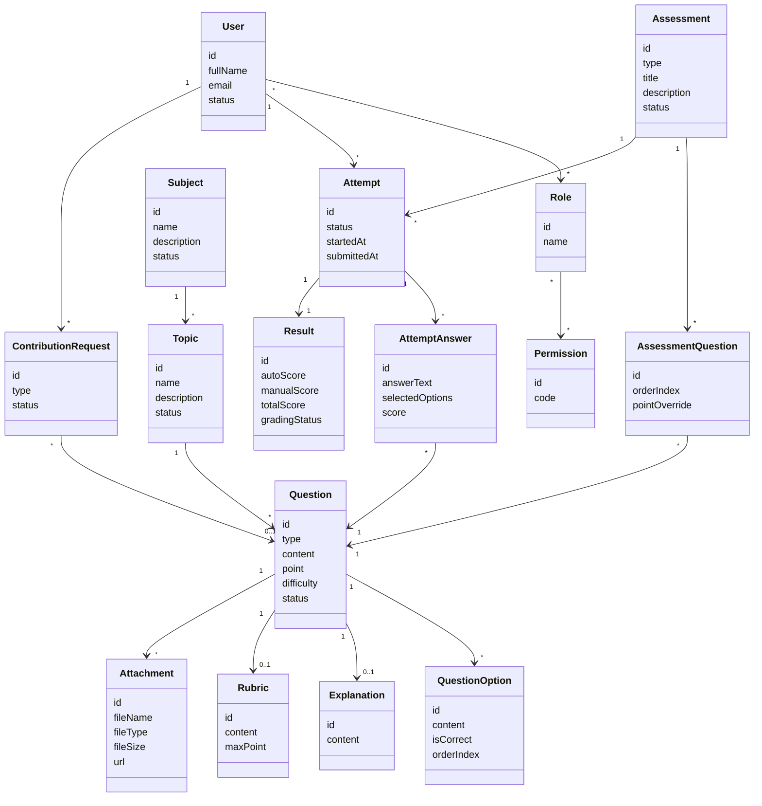

---

## 5.2. Main Aggregates

### 5.2.1. User Aggregate

Main entities:

* User
* Role
* Permission

Purpose:

* Quản lý danh tính người dùng.
* Quản lý role và permission.
* Kiểm soát quyền truy cập vào các thao tác quan trọng.

---

### 5.2.2. Learning Content Aggregate

Main entities:

* Subject
* Topic
* Learning Material
* Attachment

Purpose:

* Tổ chức nội dung học tập theo môn học và chuyên đề.
* Làm nền cho question bank và practice set.

---

### 5.2.3. Question Bank Aggregate

Main entities:

* Question
* QuestionOption
* Explanation
* Rubric
* Attachment

Purpose:

* Quản lý ngân hàng câu hỏi tập trung.
* Hỗ trợ câu hỏi trắc nghiệm và tự luận.
* Lưu đáp án, lời giải, điểm và rubric.

---

### 5.2.4. Assessment Aggregate

Main entities:

* Assessment
* Practice Set
* Screening Event
* AssessmentQuestion

Purpose:

* Gom nhiều câu hỏi thành một bài luyện tập hoặc bài sàng lọc.
* Quản lý trạng thái Draft, Published, Closed hoặc Archived.

---

### 5.2.5. Attempt & Result Aggregate

Main entities:

* Attempt
* AttemptAnswer
* Result

Purpose:

* Lưu lượt làm bài của student.
* Lưu câu trả lời.
* Tính điểm trắc nghiệm.
* Lưu điểm tự luận.
* Tổng hợp kết quả cuối cùng.

---

### 5.2.6. Contribution Aggregate

Main entities:

* ContributionRequest
* Question
* Explanation
* LearningMaterial

Purpose:

* Cho phép student có permission đóng góp nội dung.
* Teacher/admin review, approve hoặc reject nội dung.

---

# 6. Business Rules

Để tránh trùng với mã `BR` của Business Requirement ở Phase 1, Phase 2 dùng mã `RULE`.

## 6.1. User & Permission Rules

| ID       | Business Rule                                                                                              | Priority |
| -------- | ---------------------------------------------------------------------------------------------------------- | -------- |
| RULE-001 | User phải đăng nhập trước khi làm bài, xem lịch sử, tạo câu hỏi hoặc chấm bài.                             | Must     |
| RULE-002 | Student chỉ được xem attempt và result của chính mình.                                                     | Must     |
| RULE-003 | Teacher chỉ được tạo, sửa, xem và chấm nội dung trong phạm vi được phân quyền.                             | Must     |
| RULE-004 | Admin có quyền quản lý toàn bộ user, role, permission và nội dung hệ thống.                                | Must     |
| RULE-005 | Contributor không phải role độc lập bắt buộc; contributor là student có thêm permission đóng góp nội dung. | Must     |
| RULE-006 | User bị vô hiệu hóa không được đăng nhập hoặc thực hiện thao tác trong hệ thống.                           | Must     |

---

## 6.2. Subject & Topic Rules

| ID       | Business Rule                                                                 | Priority |
| -------- | ----------------------------------------------------------------------------- | -------- |
| RULE-007 | Một subject có thể có nhiều topic.                                            | Must     |
| RULE-008 | Một topic phải thuộc về đúng một subject.                                     | Must     |
| RULE-009 | Student chỉ nhìn thấy subject/topic đang được publish hoặc active.            | Must     |
| RULE-010 | Subject/topic đã có dữ liệu liên quan không nên bị xóa cứng, chỉ nên archive. | Should   |

---

## 6.3. Question Rules

| ID       | Business Rule                                                                                | Priority |
| -------- | -------------------------------------------------------------------------------------------- | -------- |
| RULE-011 | Một question phải thuộc về một topic.                                                        | Must     |
| RULE-012 | Một question phải có question type.                                                          | Must     |
| RULE-013 | Một question phải có point lớn hơn hoặc bằng 0.                                              | Must     |
| RULE-014 | Một câu hỏi trắc nghiệm phải có ít nhất 2 options.                                           | Must     |
| RULE-015 | Single choice question phải có đúng 1 correct option.                                        | Must     |
| RULE-016 | Multiple choice question phải có ít nhất 1 correct option.                                   | Must     |
| RULE-017 | Essay question không bắt buộc có option.                                                     | Must     |
| RULE-018 | Essay question nên có rubric hoặc hướng dẫn chấm nếu dùng trong bài chính thức.              | Should   |
| RULE-019 | Question đã được dùng trong attempt/submission không nên sửa trực tiếp nội dung hoặc đáp án. | Should   |
| RULE-020 | Question không còn sử dụng nên được archive thay vì xóa cứng.                                | Should   |

---

## 6.4. Assessment Rules

| ID       | Business Rule                                                                                      | Priority |
| -------- | -------------------------------------------------------------------------------------------------- | -------- |
| RULE-021 | Một assessment phải có ít nhất 1 question trước khi publish.                                       | Must     |
| RULE-022 | Student chỉ nhìn thấy assessment đã published.                                                     | Must     |
| RULE-023 | Assessment ở trạng thái Draft chưa được student làm.                                               | Must     |
| RULE-024 | Assessment đã có attempt không nên chỉnh sửa danh sách câu hỏi trực tiếp.                          | Should   |
| RULE-025 | Practice Set dùng cho mục đích ôn luyện cá nhân.                                                   | Must     |
| RULE-026 | Screening Event dùng cho mục đích tham khảo năng lực, không thay thế quyết định cuối cùng của BTC. | Must     |
| RULE-027 | Screening Event nên có start time, end time, duration và attempt limit.                            | Should   |
| RULE-028 | Kết quả screening phải hiển thị rõ là dữ liệu tham khảo.                                           | Must     |

---

## 6.5. Attempt & Submission Rules

| ID       | Business Rule                                       | Priority |
| -------- | --------------------------------------------------- | -------- |
| RULE-029 | Một attempt phải thuộc về đúng một student.         | Must     |
| RULE-030 | Một attempt phải thuộc về đúng một assessment.      | Must     |
| RULE-031 | Một attempt chỉ được submit một lần.                | Must     |
| RULE-032 | Attempt đã submit không được chỉnh sửa câu trả lời. | Must     |
| RULE-033 | System phải lưu thời điểm bắt đầu attempt.          | Must     |
| RULE-034 | System phải lưu thời điểm submit attempt.           | Must     |
| RULE-035 | Câu bỏ trống được tính 0 điểm.                      | Must     |
| RULE-036 | Không trừ điểm khi student trả lời sai trong MVP.   | Must     |

---

## 6.6. Grading Rules

| ID       | Business Rule                                                                              | Priority |
| -------- | ------------------------------------------------------------------------------------------ | -------- |
| RULE-037 | Single choice đúng được full point, sai hoặc bỏ trống được 0.                              | Must     |
| RULE-038 | Multiple choice dùng rule all-or-nothing: chọn đúng toàn bộ mới được full point.           | Must     |
| RULE-039 | Multiple choice sai, thiếu hoặc thừa đáp án đều được 0 trong MVP.                          | Must     |
| RULE-040 | Essay answer không được hệ thống tự chấm điểm trong MVP.                                   | Must     |
| RULE-041 | Essay answer phải được teacher/admin chấm thủ công.                                        | Must     |
| RULE-042 | Teacher/admin có thể nhập điểm và nhận xét cho essay answer.                               | Must     |
| RULE-043 | Total score = auto score + manual score đã được chấm.                                      | Must     |
| RULE-044 | Attempt có essay chưa chấm phải ở trạng thái Partially Graded hoặc Pending Manual Grading. | Must     |

---

## 6.7. Contribution Rules

| ID       | Business Rule                                                            | Priority |
| -------- | ------------------------------------------------------------------------ | -------- |
| RULE-045 | Chỉ student có permission contributor mới được gửi contribution request. | Could    |
| RULE-046 | Nội dung contribution phải được review trước khi publish.                | Could    |
| RULE-047 | Teacher/admin có thể approve hoặc reject contribution request.           | Could    |
| RULE-048 | Contribution bị reject không được publish vào question bank chính thức.  | Could    |
| RULE-049 | Contributor có thể xem trạng thái nội dung mình đã gửi.                  | Could    |

---

## 6.8. File & Attachment Rules

| ID       | Business Rule                                                        | Priority |
| -------- | -------------------------------------------------------------------- | -------- |
| RULE-050 | File upload phải thuộc định dạng được hệ thống cho phép.             | Should   |
| RULE-051 | File upload phải không vượt quá dung lượng tối đa.                   | Should   |
| RULE-052 | PDF/Word/Image trong MVP chỉ là attachment hoặc tài liệu tham khảo.  | Must     |
| RULE-053 | Hệ thống không tự động parse PDF/Word/Image thành câu hỏi trong MVP. | Must     |

---

# 7. Domain Events

Domain event là sự kiện nghiệp vụ quan trọng đã xảy ra trong hệ thống.

## 7.1. User & Permission Events

| Event                 | Meaning                    | Trigger             |
| --------------------- | -------------------------- | ------------------- |
| UserRegistered        | User đăng ký thành công    | User tạo tài khoản  |
| UserLoggedIn          | User đăng nhập thành công  | Login success       |
| UserRoleChanged       | Role của user thay đổi     | Admin cập nhật role |
| UserPermissionGranted | User được cấp permission   | Admin cấp quyền     |
| UserPermissionRevoked | User bị thu hồi permission | Admin thu hồi quyền |

---

## 7.2. Content Events

| Event             | Meaning                | Trigger                        |
| ----------------- | ---------------------- | ------------------------------ |
| SubjectCreated    | Subject được tạo       | Teacher/admin tạo subject      |
| TopicCreated      | Topic được tạo         | Teacher/admin tạo topic        |
| QuestionCreated   | Question được tạo      | Teacher/admin tạo câu hỏi      |
| QuestionUpdated   | Question được cập nhật | Teacher/admin sửa câu hỏi      |
| QuestionPublished | Question được publish  | Teacher/admin publish question |
| QuestionArchived  | Question được archive  | Teacher/admin archive question |

---

## 7.3. Assessment Events

| Event                   | Meaning                          | Trigger                              |
| ----------------------- | -------------------------------- | ------------------------------------ |
| AssessmentCreated       | Assessment được tạo              | Teacher/admin tạo practice/screening |
| AssessmentQuestionAdded | Câu hỏi được thêm vào assessment | Teacher/admin thêm câu hỏi           |
| AssessmentPublished     | Assessment được publish          | Teacher/admin publish assessment     |
| AssessmentClosed        | Assessment được đóng             | Teacher/admin/BTC đóng assessment    |
| AssessmentArchived      | Assessment được archive          | Teacher/admin archive assessment     |

---

## 7.4. Attempt & Grading Events

| Event                 | Meaning                        | Trigger                                          |
| --------------------- | ------------------------------ | ------------------------------------------------ |
| AttemptStarted        | Student bắt đầu làm bài        | Student mở assessment và bắt đầu attempt         |
| AnswerSaved           | Câu trả lời được lưu           | Student trả lời câu hỏi                          |
| AttemptSubmitted      | Student nộp bài                | Student submit attempt                           |
| AutoGradingCompleted  | Hệ thống chấm xong trắc nghiệm | Sau khi submit                                   |
| EssayGradingRequested | Bài tự luận cần chấm           | Attempt có essay answer                          |
| EssayGraded           | Teacher/admin chấm tự luận     | Teacher/admin nhập điểm                          |
| ResultUpdated         | Kết quả được cập nhật          | Auto grading hoặc manual grading hoàn tất        |
| ResultPublished       | Kết quả được công bố           | Teacher/admin/BTC publish result nếu có cấu hình |

---

## 7.5. Contribution Events

| Event                 | Meaning                        | Trigger                    |
| --------------------- | ------------------------------ | -------------------------- |
| ContributionSubmitted | Contributor gửi nội dung       | Contributor submit request |
| ContributionApproved  | Nội dung được duyệt            | Teacher/admin approve      |
| ContributionRejected  | Nội dung bị từ chối            | Teacher/admin reject       |
| ContributionPublished | Nội dung đóng góp được publish | Teacher/admin publish      |

---

# 8. State Diagrams

## 8.1. Question State Diagram

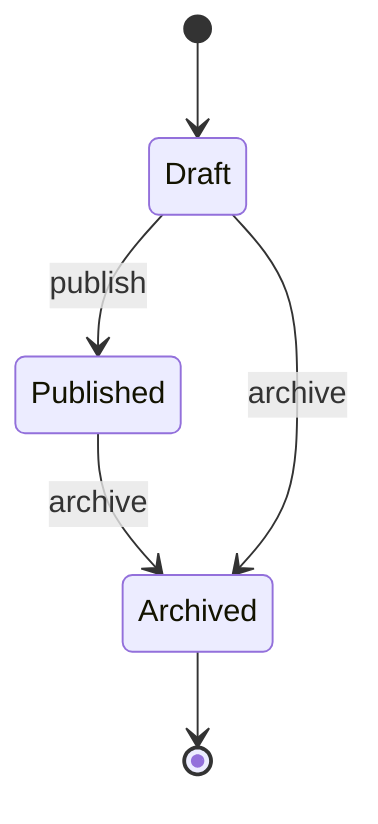

MVP Core dùng state đơn giản:

```text id="umkv7r"
Draft -> Published -> Archived
```

MVP Extended có thể mở rộng:

```text id="iknvuz"
Draft -> Pending Review -> Approved -> Published -> Archived
                         -> Rejected
```

---

## 8.2. Contribution Request State Diagram

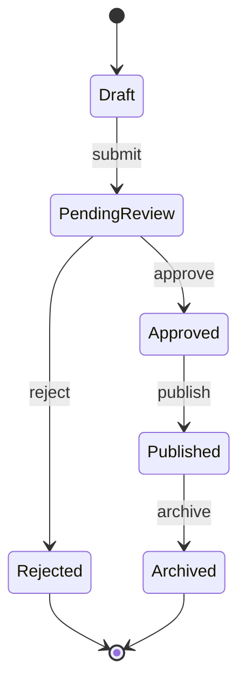

---

## 8.3. Assessment State Diagram

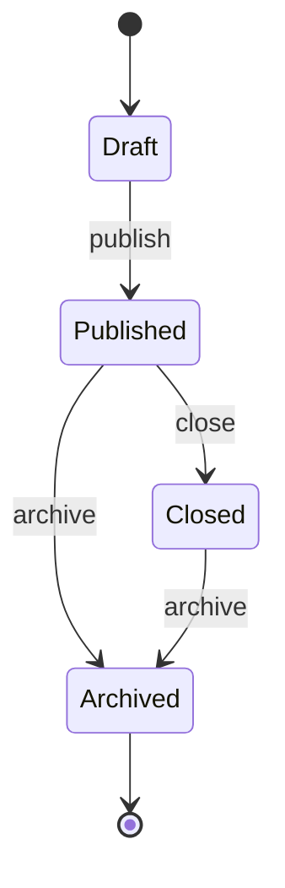

State meaning:

| State     | Meaning                                            |
| --------- | -------------------------------------------------- |
| Draft     | Bài đang soạn, student chưa thấy                   |
| Published | Bài đã công bố, student có thể làm                 |
| Closed    | Bài đã đóng, student không thể bắt đầu attempt mới |
| Archived  | Bài không còn sử dụng nhưng vẫn lưu lịch sử        |

---

## 8.4. Attempt State Diagram

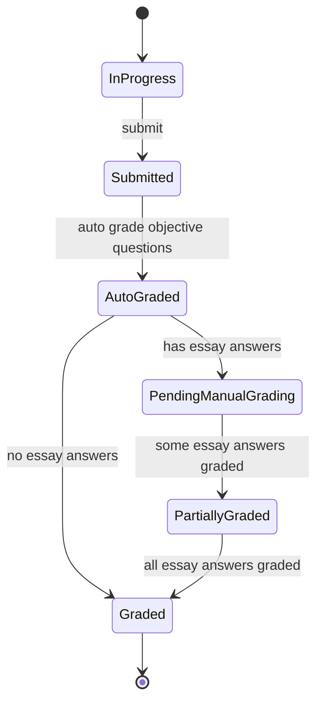

State meaning:

| State                | Meaning                                           |
| -------------------- | ------------------------------------------------- |
| InProgress           | Student đang làm bài                              |
| Submitted            | Student đã nộp bài                                |
| AutoGraded           | Hệ thống đã chấm xong phần trắc nghiệm            |
| PendingManualGrading | Bài có tự luận và đang chờ chấm                   |
| PartiallyGraded      | Một phần tự luận đã được chấm nhưng chưa hoàn tất |
| Graded               | Bài đã có kết quả cuối cùng                       |

---

## 8.5. User State Diagram

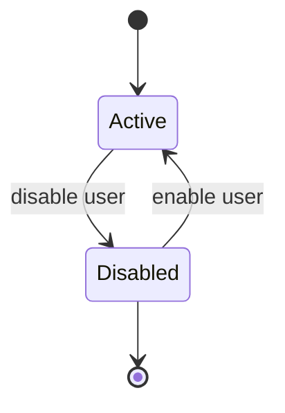

---

# 9. Core Workflows

## 9.1. Workflow 1 — Teacher tạo câu hỏi

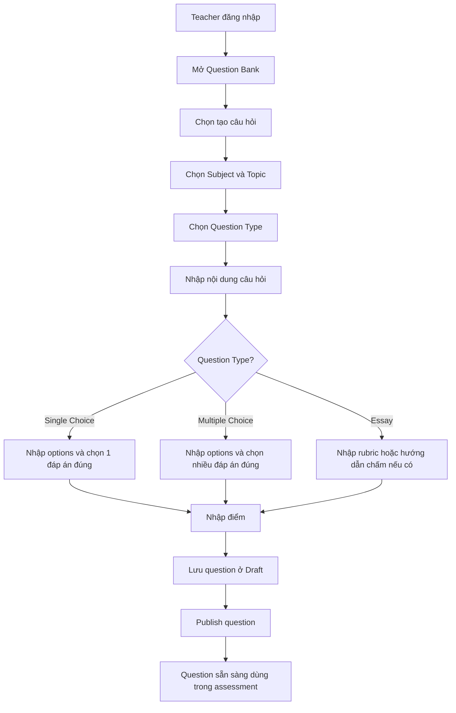

---

## 9.2. Workflow 2 — Teacher tạo Practice Set

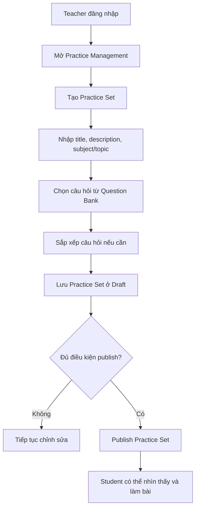

---

## 9.3. Workflow 3 — Student làm bài và submit

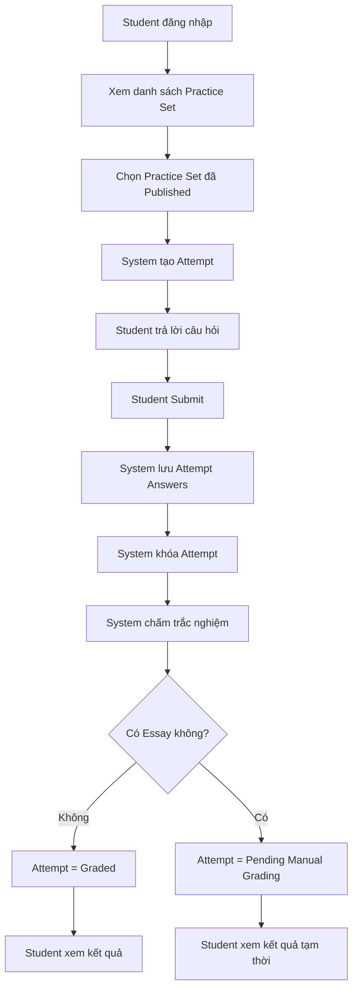

---

## 9.4. Workflow 4 — Teacher chấm tự luận

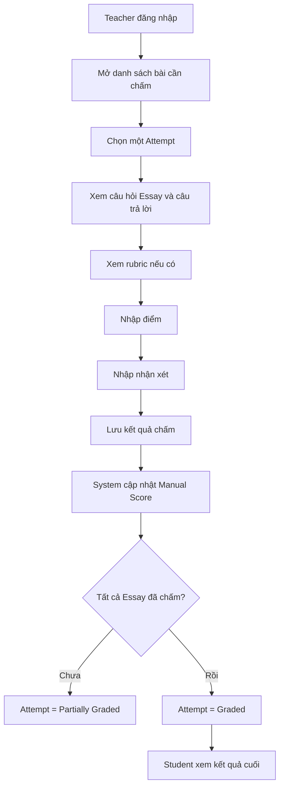

---

## 9.5. Workflow 5 — BTC xem kết quả Screening

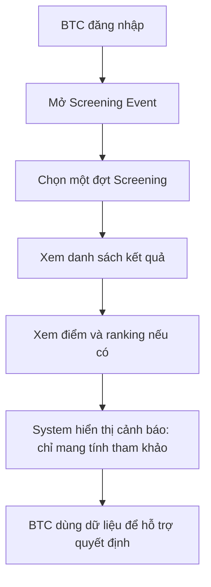

---

## 9.6. Workflow 6 — Contributor gửi câu hỏi

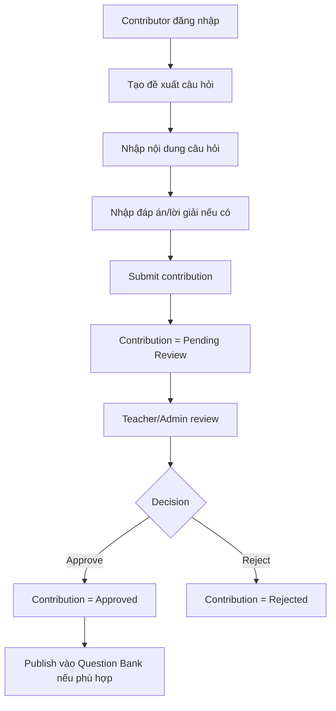

---

# 10. Domain Constraints

| ID     | Constraint                                                          | Explanation                                                         |
| ------ | ------------------------------------------------------------------- | ------------------------------------------------------------------- |
| DC-001 | Không xóa cứng dữ liệu quan trọng                                   | Question, assessment, attempt và result nên archive để giữ lịch sử. |
| DC-002 | Attempt sau khi submit là immutable                                 | Không cho sửa câu trả lời sau khi nộp.                              |
| DC-003 | Screening result chỉ là tham khảo                                   | Không được thiết kế UI như quyết định tuyển chọn cuối cùng.         |
| DC-004 | PDF/Word/Image không được parse tự động trong MVP                   | Chỉ upload/attachment, tránh vỡ scope.                              |
| DC-005 | Question đã dùng trong submission cần xử lý cẩn thận khi chỉnh sửa  | Nên lock hoặc tạo version mới ở phase sau.                          |
| DC-006 | Role và permission phải được kiểm tra trước các thao tác quan trọng | Tránh student truy cập chức năng teacher/admin.                     |

---

# 11. Phase 2 Exit Criteria

Phase 2 được xem là hoàn thành khi:

* Có glossary thống nhất.
* Có domain model mô tả các entity chính và quan hệ giữa chúng.
* Có main aggregate để định hướng thiết kế hệ thống.
* Có business rules rõ ràng.
* Có domain events cho các nghiệp vụ quan trọng.
* Có state transition cho object quan trọng như Question, Assessment, Attempt, Contribution Request.
* Có core workflows cho các flow chính.
* Các khái niệm domain không mâu thuẫn với Phase 0 và Phase 1.
* Các rule quan trọng có thể dùng làm đầu vào cho database design, API design và test case ở phase sau.

Với các nội dung trên, Phase 2 có thể được chốt và chuyển sang Phase 3 — System Design.

---

# 12. Next Phase

Phase tiếp theo:

# Phase 3 — System Design

Các artifact nên tạo ở Phase 3:

```text id="gy28td"
3.1 System Architecture
3.2 C4 Model
3.3 Permission Matrix
3.4 Database Design / ERD
3.5 API Specification
3.6 Sequence Diagrams
3.7 Activity Diagrams
3.8 Error Handling Strategy
3.9 File Storage Strategy
```

Phase 3 sẽ chuyển domain analysis thành thiết kế kỹ thuật cụ thể để chuẩn bị implementation.

---
