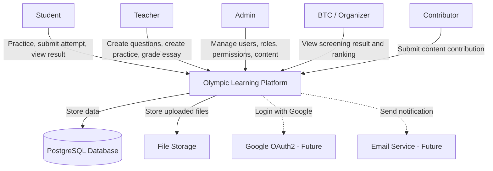
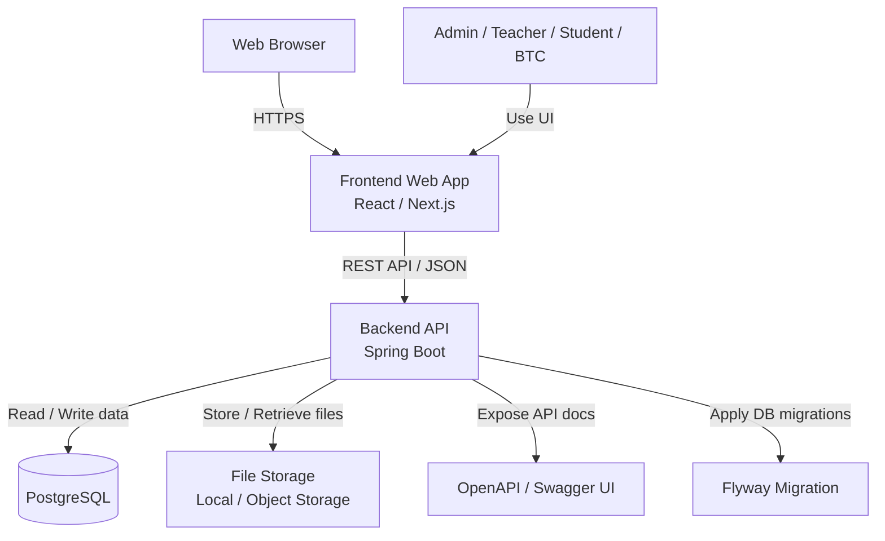
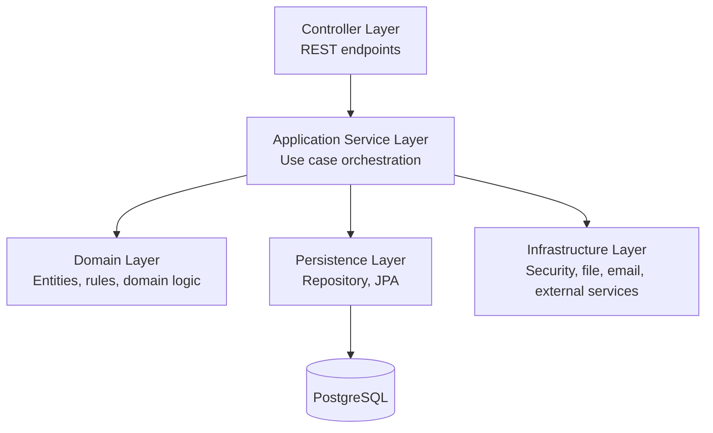
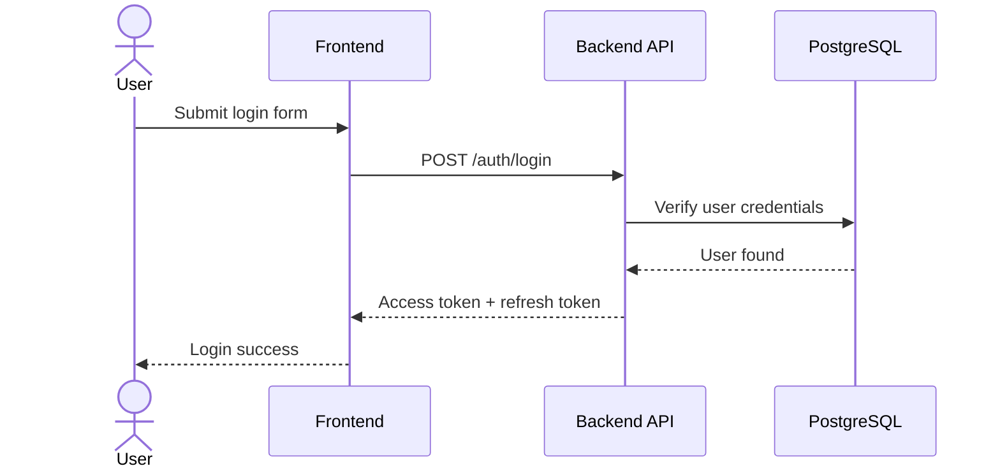
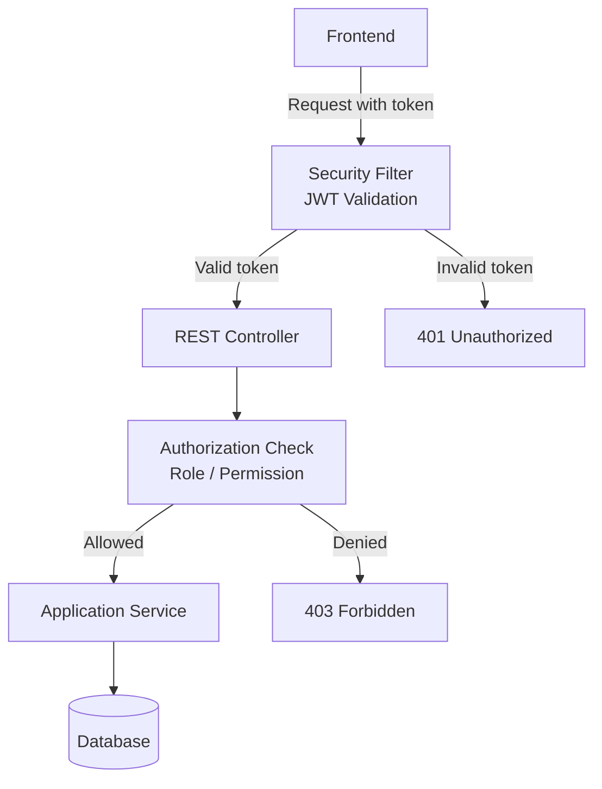
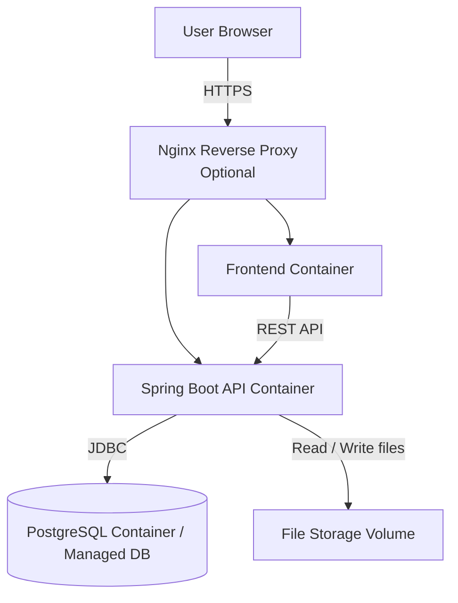

# Olympic Learning Platform — Phase 3 Architecture Design

## 1. Document Information

| Field         | Value                                                                                                                                                  |
| ------------- | ------------------------------------------------------------------------------------------------------------------------------------------------------ |
| Project name  | Olympic Learning Platform                                                                                                                              |
| Phase         | Phase 3 — Architecture Design                                                                                                                          |
| Status        | Final baseline                                                                                                                                         |
| Based on      | Phase 0 — Project Initiation, Phase 1 — Requirements Engineering, Phase 2 — Domain Analysis                                                            |
| Purpose       | Chốt kiến trúc tổng thể, công nghệ chính, security architecture, deployment view và các Architecture Decision Records trước khi sang thiết kế chi tiết |
| Main question | Hệ thống sẽ được tổ chức như thế nào?                                                                                                                  |

---

## 2. Phase 3 Goal

Phase 3 trả lời câu hỏi:

> Hệ thống Olympic Learning Platform sẽ được tổ chức như thế nào để dễ maintain, dễ mở rộng, bảo mật đủ tốt và phù hợp với MVP?

Phase này tập trung vào kiến trúc tổng thể, chưa đi quá sâu vào database schema, API endpoint chi tiết hoặc UI wireframe.

Các artifact trong Phase 3:

```text id="8svmih"
3.1 Architecture Drivers
3.2 C4 Context Diagram
3.3 C4 Container Diagram
3.4 Technology Decisions
3.5 Architecture Decision Records
3.6 Security Architecture
3.7 Deployment View
```

---

## 3. Architecture Scope

Phase 3 tập trung vào các quyết định kiến trúc chính:

* Architecture style.
* Backend framework.
* Database.
* Authentication & authorization.
* API documentation.
* Migration strategy.
* File storage direction.
* Deployment direction.
* Security boundaries.
* Integration points for future features such as Excel import, AI grading, OCR and analytics.

---

## 4. Architecture Drivers

Architecture drivers là các yếu tố ảnh hưởng trực tiếp đến quyết định kiến trúc.

| ID     | Architecture Driver                                    | Explanation                                                         | Priority |
| ------ | ------------------------------------------------------ | ------------------------------------------------------------------- | -------- |
| AD-001 | Dễ maintain cho Spring Boot project                    | Project cần code rõ module, dễ đọc, dễ sửa, phù hợp backend Java.   | Must     |
| AD-002 | Dễ mở rộng thêm subject, topic, question và assessment | Domain có nhiều thực thể học thuật nên cần thiết kế mở rộng.        | Must     |
| AD-003 | Hỗ trợ role/permission rõ ràng                         | Hệ thống có Student, Teacher, Admin, BTC và Contributor permission. | Must     |
| AD-004 | Dễ expose REST API cho frontend                        | Frontend cần gọi API rõ ràng, nhất quán.                            | Must     |
| AD-005 | Dễ thêm JWT và OAuth2                                  | MVP cần đăng nhập cơ bản, sau này có thể thêm Google OAuth2.        | Must     |
| AD-006 | Dễ thêm Excel import sau này                           | Excel import là MVP Extended, cần chừa chỗ trong kiến trúc.         | Should   |
| AD-007 | Dễ thêm file upload                                    | PDF/Word/Image là attachment, cần hướng lưu file rõ ràng.           | Should   |
| AD-008 | Dễ thêm AI grading/OCR ở phase sau                     | MVP chưa làm AI/OCR nhưng kiến trúc không nên khóa đường mở rộng.   | Should   |
| AD-009 | Dễ backup và migrate database                          | Dữ liệu câu hỏi, bài làm, kết quả là dữ liệu quan trọng.            | Must     |
| AD-010 | Phù hợp với team nhỏ và MVP                            | Không dùng microservices quá sớm để tránh phức tạp vận hành.        | Must     |

---

## 5. Architecture Style

## 5.1. Selected Architecture Style

Architecture style được chọn:

```text id="p5g9xk"
Modular Layered Monolith
```

Nghĩa là hệ thống được triển khai trước dưới dạng **một backend application** nhưng code được chia module rõ ràng theo nghiệp vụ.

Các layer chính:

```text id="vjzoft"
Controller Layer
Application / Service Layer
Domain Layer
Infrastructure Layer
Persistence Layer
```

---

## 5.2. Why Modular Layered Monolith?

| Reason                 | Explanation                                                              |
| ---------------------- | ------------------------------------------------------------------------ |
| Phù hợp MVP            | MVP chưa cần microservices. Một monolith dễ build, test và deploy hơn.   |
| Dễ maintain            | Chia module theo domain giúp code không bị dồn vào một chỗ.              |
| Dễ mở rộng             | Sau này có thể tách module lớn ra service riêng nếu thật sự cần.         |
| Phù hợp Spring Boot    | Spring Boot rất hợp với layered architecture và module package rõ ràng.  |
| Giảm vận hành phức tạp | Không cần service discovery, distributed tracing, message broker từ đầu. |
| Hỗ trợ REST API tốt    | Backend expose API rõ cho frontend.                                      |

---

## 5.3. Main Backend Modules

Backend có thể chia module theo domain:

```text id="lif0x2"
common
identity
learning
question
assessment
attempt
grading
result
file
import
contribution
audit
```

Ý nghĩa:

| Module       | Responsibility                                                   |
| ------------ | ---------------------------------------------------------------- |
| common       | Exception, response format, validation, config, utility          |
| identity     | Auth, user, role, permission, JWT, OAuth2-ready access control   |
| learning     | Subject, topic và cấu trúc học tập                               |
| question     | Question bank, option, answer key, explanation, rubric, lifecycle |
| assessment   | Practice set, screening exam baseline, exam questions, lifecycle |
| attempt      | Start attempt, save answer, submit attempt                       |
| grading      | Auto grading và manual essay grading                             |
| result       | Tổng hợp điểm, lịch sử làm bài, visibility của kết quả           |
| file         | File upload, attachment, storage abstraction                      |
| import       | Excel import question bank theo template                         |
| contribution | Contribution workflow                                            |
| audit        | Audit log                                                        |

Baseline module decision:

```text id="7u4dbn"
MVP bắt đầu với core learning loop:
identity -> learning -> question -> assessment -> attempt -> grading -> result

Các module file, import, contribution và audit là supporting/extended module.
Screening chưa tách module riêng trong MVP; screening được biểu diễn bằng assessment.examType = SCREENING.
Khi screening có participant list, ranking, export và BTC dashboard phức tạp, có thể tách module screening riêng.
```

---

# 6. C4 Context Diagram

## 6.1. System Context



---

## 6.2. Context Explanation

| External Actor/System | Relationship                                       |
| --------------------- | -------------------------------------------------- |
| Student               | Làm bài luyện tập, nộp bài, xem kết quả và lịch sử |
| Teacher               | Tạo nội dung, tạo bài, chấm tự luận                |
| Admin                 | Quản lý user, role, permission và dữ liệu hệ thống |
| BTC / Organizer       | Xem kết quả screening để tham khảo                 |
| Contributor           | Đề xuất câu hỏi, lời giải hoặc tài liệu            |
| PostgreSQL            | Lưu dữ liệu chính của hệ thống                     |
| File Storage          | Lưu file PDF/Word/Image attachment                 |
| Google OAuth2         | Có thể dùng cho đăng nhập Google ở phase sau       |
| Email Service         | Có thể dùng cho notification ở phase sau           |

---

# 7. C4 Container Diagram

## 7.1. Container View



---

## 7.2. Container Responsibilities

| Container        | Technology                                      | Responsibility                           |
| ---------------- | ----------------------------------------------- | ---------------------------------------- |
| Frontend Web App | React hoặc Next.js                              | UI cho student, teacher, admin, BTC      |
| Backend API      | Spring Boot                                     | Xử lý nghiệp vụ, auth, grading, REST API |
| PostgreSQL       | PostgreSQL                                      | Lưu dữ liệu chính                        |
| File Storage     | Local storage trong MVP, object storage sau này | Lưu attachment như PDF/Word/Image        |
| OpenAPI/Swagger  | Springdoc OpenAPI                               | Tài liệu API                             |
| Flyway Migration | Flyway                                          | Quản lý schema migration                 |

---

# 8. Backend Layered Architecture

## 8.1. Layer Overview



---

## 8.2. Layer Responsibility

| Layer                     | Responsibility                                                  |
| ------------------------- | --------------------------------------------------------------- |
| Controller Layer          | Nhận HTTP request, validate request cơ bản, trả response        |
| Application Service Layer | Điều phối use case, transaction boundary, gọi domain/repository |
| Domain Layer              | Chứa entity, enum, domain rules quan trọng                      |
| Persistence Layer         | Repository, JPA entity mapping, query database                  |
| Infrastructure Layer      | Security, file storage, external integration, email, OAuth2     |
| Common Layer              | Exception handling, response format, constants, utility         |

---

## 8.3. Suggested Package Structure

```text id="a27g2z"
me.nghlong3004.olympic.api
├── common
│   ├── exception
│   ├── response
│   ├── validation
│   └── config
├── identity
│   ├── controller
│   ├── service
│   ├── domain
│   ├── repository
│   ├── dto
│   └── security
├── learning
│   ├── controller
│   ├── service
│   ├── domain
│   ├── repository
│   └── dto
├── question
│   ├── controller
│   ├── service
│   ├── domain
│   ├── repository
│   └── dto
├── assessment
│   ├── controller
│   ├── service
│   ├── domain
│   ├── repository
│   └── dto
├── attempt
│   ├── controller
│   ├── service
│   ├── domain
│   ├── repository
│   └── dto
├── grading
│   ├── service
│   └── strategy
├── result
│   ├── controller
│   ├── service
│   ├── domain
│   ├── repository
│   └── dto
├── file
│   ├── controller
│   ├── service
│   └── storage
├── import
│   ├── controller
│   ├── service
│   └── dto
├── contribution
│   ├── controller
│   ├── service
│   ├── domain
│   ├── repository
│   └── dto
├── audit
│   ├── service
│   ├── domain
│   └── repository
```

---

# 9. Technology Decisions

## 9.1. Selected Technology Stack

| Area          | Decision                                      | Reason                                                    |
| ------------- | --------------------------------------------- | --------------------------------------------------------- |
| Backend       | Spring Boot                                   | Phù hợp Java backend, REST API, security, validation, JPA |
| Language      | Java 21                                       | LTS, hiện đại, phù hợp Spring Boot mới                    |
| Database      | PostgreSQL                                    | Mạnh về relational data, phù hợp domain nhiều quan hệ     |
| ORM           | Spring Data JPA / Hibernate                   | Giảm boilerplate CRUD, phù hợp Spring ecosystem           |
| Migration     | Flyway                                        | Quản lý schema version rõ ràng                            |
| Auth          | JWT + OAuth2-ready                            | JWT cho API stateless, OAuth2 để mở rộng login Google     |
| API Docs      | OpenAPI/Swagger                               | Frontend/backend dễ phối hợp                              |
| Validation    | Bean Validation                               | Validate request DTO rõ ràng                              |
| Build Tool    | Maven                                         | Phổ biến với Spring Boot                                  |
| File Storage  | Local storage trong MVP, object storage-ready | Dễ làm MVP, có thể chuyển S3/MinIO sau                    |
| Deployment    | Docker Compose                                | Dễ chạy local/dev/staging                                 |
| Reverse Proxy | Nginx optional                                | Hỗ trợ HTTPS, route frontend/backend                      |
| Testing       | JUnit 5, Mockito, Testcontainers optional     | Hỗ trợ unit/integration test                              |

---

## 9.2. Deferred Technology Decisions

Các công nghệ chưa dùng trong MVP nhưng có thể thêm sau:

| Future Need      | Possible Technology                              |
| ---------------- | ------------------------------------------------ |
| Background job   | Spring Scheduler, Quartz hoặc message queue      |
| Async processing | RabbitMQ, Kafka hoặc Redis Queue                 |
| Cache            | Redis                                            |
| Object storage   | S3, MinIO hoặc Cloudflare R2                     |
| AI grading       | External LLM API hoặc internal AI service        |
| OCR              | Tesseract, PaddleOCR hoặc external OCR API       |
| Analytics        | Materialized views, ClickHouse hoặc BI dashboard |
| Notification     | Email service, WebSocket hoặc push notification  |

---

# 10. Security Architecture

## 10.1. Authentication

MVP sử dụng JWT-based authentication.

Luồng cơ bản:



Baseline:

* Access token dùng để gọi API.
* Refresh token dùng để lấy access token mới.
* Password phải được hash bằng thuật toán an toàn, ví dụ BCrypt.
* OAuth2 Google có thể thêm sau mà không phá kiến trúc hiện tại.

---

## 10.2. Authorization

Authorization dựa trên role và permission.

| Actor       | Access Direction                                                  |
| ----------- | ----------------------------------------------------------------- |
| Student     | Làm bài, xem result/history của chính mình                        |
| Contributor | Student + quyền gửi contribution                                  |
| Teacher     | Quản lý câu hỏi, practice, chấm bài trong phạm vi được phân quyền |
| Admin       | Quản lý toàn hệ thống                                             |
| BTC         | Xem kết quả screening, ranking/thống kê tham khảo                 |

Baseline permission examples:

```text id="6fmgc5"
USER_MANAGE
ROLE_MANAGE
SUBJECT_MANAGE
TOPIC_MANAGE
QUESTION_CREATE
QUESTION_UPDATE
QUESTION_PUBLISH
QUESTION_ARCHIVE
QUESTION_CONTRIBUTE
ASSESSMENT_CREATE
ASSESSMENT_PUBLISH
ATTEMPT_SUBMIT
ESSAY_GRADE
RESULT_VIEW_OWN
RESULT_VIEW_ALL
SCREENING_VIEW
```

---

## 10.3. Security Rules

| ID      | Security Rule                                              |
| ------- | ---------------------------------------------------------- |
| SEC-001 | API yêu cầu đăng nhập phải kiểm tra JWT hợp lệ.            |
| SEC-002 | API quản trị phải kiểm tra role/permission.                |
| SEC-003 | Student không được xem result của student khác.            |
| SEC-004 | Teacher không được chấm bài ngoài phạm vi được phân quyền. |
| SEC-005 | Admin có quyền toàn hệ thống.                              |
| SEC-006 | Password phải được hash, không lưu plain text.             |
| SEC-007 | File upload phải validate file type và file size.          |
| SEC-008 | Input từ user phải được validate ở backend.                |
| SEC-009 | Attempt đã submit không được chỉnh sửa.                    |
| SEC-010 | Các thao tác quan trọng nên được ghi audit log.            |

---

## 10.4. API Security Boundary



---

# 11. Deployment View

## 11.1. MVP Deployment

MVP deployment có thể chạy bằng Docker Compose.



---

## 11.2. Deployment Components

| Component           | Description                                  |
| ------------------- | -------------------------------------------- |
| Frontend container  | Chạy web UI                                  |
| Backend container   | Chạy Spring Boot REST API                    |
| PostgreSQL          | Database chính                               |
| File storage volume | Lưu attachment trong MVP                     |
| Nginx               | Reverse proxy, HTTPS, route frontend/backend |
| Docker Compose      | Quản lý các container trong dev/staging      |

---

## 11.3. Environment Strategy

| Environment | Purpose                                        |
| ----------- | ---------------------------------------------- |
| local       | Developer chạy trên máy cá nhân                |
| dev         | Môi trường test nội bộ                         |
| staging     | Môi trường gần production để demo/pilot        |
| production  | Môi trường dùng thật nếu triển khai chính thức |

MVP có thể bắt đầu với:

```text id="4jw16u"
local -> staging
```

Production có thể thêm sau khi hệ thống ổn định.

---

## 11.4. Configuration Strategy

Cấu hình nên tách theo environment:

```text id="y2gv18"
application-local.yml
application-dev.yml
application-staging.yml
application-prod.yml
```

Các biến nhạy cảm không hard-code trong source code:

```text id="2gdul7"
DB_USERNAME
DB_PASSWORD
JWT_SECRET
OAUTH_CLIENT_ID
OAUTH_CLIENT_SECRET
FILE_STORAGE_PATH
```

---

# 12. Architecture Decision Records

## ADR-001 — Use Modular Layered Monolith

| Field        | Value                                                                          |
| ------------ | ------------------------------------------------------------------------------ |
| Status       | Accepted                                                                       |
| Context      | Project MVP cần build nhanh, team nhỏ, domain còn đang phát triển.             |
| Decision     | Sử dụng Modular Layered Monolith thay vì microservices.                        |
| Consequences | Dễ build, dễ test, dễ deploy. Cần giữ module boundary rõ để tránh code bị rối. |

---

## ADR-002 — Use Spring Boot for Backend

| Field        | Value                                                                                        |
| ------------ | -------------------------------------------------------------------------------------------- |
| Status       | Accepted                                                                                     |
| Context      | Project định hướng backend Java, cần REST API, security, validation và database integration. |
| Decision     | Chọn Spring Boot làm backend framework.                                                      |
| Consequences | Tận dụng Spring ecosystem. Cần quản lý cấu trúc package rõ để tránh service quá lớn.         |

---

## ADR-003 — Use PostgreSQL as Primary Database

| Field        | Value                                                                                    |
| ------------ | ---------------------------------------------------------------------------------------- |
| Status       | Accepted                                                                                 |
| Context      | Domain có nhiều quan hệ như user, subject, topic, question, assessment, attempt, result. |
| Decision     | Chọn PostgreSQL làm database chính.                                                      |
| Consequences | Phù hợp relational data. Cần thiết kế schema và index tốt ở phase sau.                   |

---

## ADR-004 — Use Flyway for Database Migration

| Field        | Value                                                                              |
| ------------ | ---------------------------------------------------------------------------------- |
| Status       | Accepted                                                                           |
| Context      | Schema sẽ thay đổi nhiều trong quá trình phát triển MVP.                           |
| Decision     | Dùng Flyway để quản lý database migration.                                         |
| Consequences | Schema thay đổi có version rõ ràng. Developer cần tuân thủ quy ước migration file. |

---

## ADR-005 — Use JWT with OAuth2-ready Design

| Field        | Value                                                                                     |
| ------------ | ----------------------------------------------------------------------------------------- |
| Status       | Accepted                                                                                  |
| Context      | Hệ thống cần authentication cho REST API và có thể thêm Google OAuth2 sau.                |
| Decision     | MVP dùng JWT-based authentication, thiết kế sẵn để mở rộng OAuth2.                        |
| Consequences | API stateless, dễ dùng với frontend. Cần xử lý token expiration và refresh token an toàn. |

---

## ADR-006 — Use OpenAPI/Swagger for API Documentation

| Field        | Value                                                                             |
| ------------ | --------------------------------------------------------------------------------- |
| Status       | Accepted                                                                          |
| Context      | Frontend và backend cần thống nhất API contract.                                  |
| Decision     | Dùng OpenAPI/Swagger để document REST API.                                        |
| Consequences | Dễ test API, dễ giao tiếp giữa frontend/backend. Cần giữ docs cập nhật theo code. |

---

## ADR-007 — Use Local File Storage for MVP, Object Storage Later

| Field        | Value                                                                                 |
| ------------ | ------------------------------------------------------------------------------------- |
| Status       | Accepted                                                                              |
| Context      | MVP cần upload attachment nhưng chưa cần scale lớn.                                   |
| Decision     | Dùng local file storage trong MVP, thiết kế interface để sau này đổi sang S3/MinIO.   |
| Consequences | Dễ triển khai ban đầu. Khi lên production cần cân nhắc object storage và backup file. |

---

## ADR-008 — Defer Microservices, AI Grading and OCR

| Field        | Value                                                                      |
| ------------ | -------------------------------------------------------------------------- |
| Status       | Accepted                                                                   |
| Context      | AI grading, OCR và microservices sẽ làm MVP phức tạp quá mức.              |
| Decision     | Không triển khai microservices, AI grading và OCR trong MVP.               |
| Consequences | MVP tập trung core flow. Kiến trúc vẫn giữ module boundary để mở rộng sau. |

---

# 13. Architecture Risks

| ID     | Risk                                                                 | Impact      | Mitigation                                                      |
| ------ | -------------------------------------------------------------------- | ----------- | --------------------------------------------------------------- |
| AR-001 | Monolith bị rối nếu không giữ module boundary                        | High        | Chia package theo domain, hạn chế service gọi chéo tùy tiện     |
| AR-002 | Role/permission phức tạp                                             | Medium-High | Làm permission matrix trước khi code authorization              |
| AR-003 | Question/assessment chỉnh sửa sau khi có attempt gây sai lệch result | High        | Lock hoặc versioning ở phase sau                                |
| AR-004 | File storage local khó scale khi production                          | Medium      | Bọc qua FileStorageService interface để đổi sang object storage |
| AR-005 | Excel import có thể làm phức tạp validation                          | Medium      | Đưa vào module import riêng, validate theo template             |
| AR-006 | JWT/refresh token xử lý không kỹ có thể tạo lỗ hổng bảo mật          | High        | Thiết kế token expiration, refresh flow và logout rõ ràng       |
| AR-007 | API thiếu chuẩn response/error format gây khó tích hợp frontend      | Medium      | Chốt common response và error handling ở phase sau              |

---

# 14. Architecture Constraints

| ID      | Constraint                                | Explanation                        |
| ------- | ----------------------------------------- | ---------------------------------- |
| ACN-001 | Backend dùng Spring Boot                  | Đã chốt ở Phase 0/1                |
| ACN-002 | Database dùng PostgreSQL                  | Phù hợp relational domain          |
| ACN-003 | API expose theo REST                      | Frontend gọi backend qua HTTP/JSON |
| ACN-004 | MVP không dùng microservices              | Tránh tăng độ phức tạp vận hành    |
| ACN-005 | MVP không tự động parse PDF/Word/Image    | Chỉ upload hoặc attachment         |
| ACN-006 | MVP không tự chấm tự luận bằng AI         | Tự luận chấm thủ công              |
| ACN-007 | Kết quả screening chỉ mang tính tham khảo | Phải thể hiện trong UI/API docs    |

---

# 15. Phase 3 Exit Criteria

Phase 3 được xem là hoàn thành khi:

* Chọn được architecture style.
* Có architecture drivers rõ ràng.
* Có C4 Context Diagram.
* Có C4 Container Diagram.
* Có backend layered architecture.
* Có technology decisions.
* Có security architecture.
* Có deployment view.
* Có các Architecture Decision Records quan trọng.
* Có architecture risks và constraints.
* Các quyết định kiến trúc không mâu thuẫn với Phase 0, Phase 1 và Phase 2.

Với các nội dung trên, Phase 3 có thể được chốt và chuyển sang Phase 4 — Detailed Design.

---

# 16. Next Phase

Phase tiếp theo:

# Phase 4 — Detailed Design

Các artifact nên tạo ở Phase 4:

```text id="q9fbdb"
4.1 Permission Matrix
4.2 Database Design / ERD
4.3 API Specification
4.4 Request / Response DTO Design
4.5 Error Handling Strategy
4.6 File Storage Design
4.7 Sequence Diagrams
4.8 Validation Rules
4.9 Package Structure
```

Phase 4 sẽ chuyển architecture thành thiết kế kỹ thuật chi tiết để chuẩn bị implementation.

---
