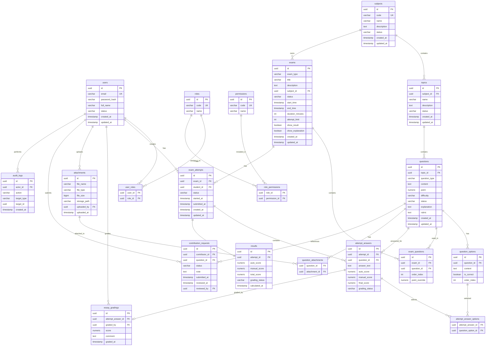

# Olympic Learning Platform — Phase 4 Data Design

## 1. Document Information

| Field         | Value                                                                                             |
| ------------- | ------------------------------------------------------------------------------------------------- |
| Project name  | Olympic Learning Platform                                                                         |
| Phase         | Phase 4 — Data Design                                                                             |
| Status        | Final baseline                                                                                    |
| Based on      | Phase 0, Phase 1, Phase 2, Phase 3                                                                |
| Purpose       | Thiết kế dữ liệu, ERD, schema, data dictionary, constraint, validation rule và migration strategy |
| Main question | Dữ liệu của hệ thống sẽ được lưu như thế nào?                                                     |

---

## 2. Phase 4 Goal

Phase 4 trả lời câu hỏi:

> Hệ thống cần lưu những dữ liệu nào, các bảng liên hệ với nhau ra sao, khóa chính/khóa ngoại là gì, constraint nào cần có, và migration bằng Flyway sẽ tổ chức thế nào?

Các artifact trong Phase 4:

```text id="khpq72"
4.1 Conceptual Data Model
4.2 Logical ERD
4.3 Physical Schema
4.4 Data Dictionary
4.5 Migration Strategy
4.6 Data Validation Rules
```

---

## 3. Data Design Scope

Phase này tập trung vào MVP Core và một phần MVP Extended cần chuẩn bị sẵn.

### 3.1. MVP Core Tables

Các bảng chính trong MVP Core:

```text id="f7gzz2"
users
roles
permissions
user_roles
role_permissions
subjects
topics
questions
question_options
exams
exam_questions
exam_attempts
attempt_answers
essay_gradings
results
```

### 3.2. MVP Extended Tables

Các bảng có thể dùng cho MVP Extended:

```text id="m2qfuy"
attachments
question_attachments
contribution_requests
audit_logs
```

### 3.3. Deferred / Explicitly Scoped Tables

Các bảng sau chưa đưa vào MVP Core migration đầu tiên, nhưng cần được ghi nhận để tránh hiểu nhầm khi triển khai:

```text id="tg42mk"
teacher_subject_scopes
exam_participants
screening_participants
user_permissions
question_versions
attempt_question_snapshots
```

Baseline decision:

```text id="3j9r2c"
Trong MVP đầu tiên, Teacher/Admin có quyền thao tác nội dung theo role/permission ở mức hệ thống.
Nếu cần giới hạn Teacher theo subject/exam, thêm bảng scope assignment ở migration sau.
Contributor không phải role bắt buộc; nếu cần cấp permission trực tiếp cho từng Student, thêm user_permissions.
Screening participant list, ranking và export là MVP Extended, chưa bắt buộc trong schema core.
```

---

## 4. Naming Decision

Ở Phase 2, domain dùng khái niệm tổng quát là `Assessment`.

Trong database, Phase 4 chọn tên bảng:

```text id="j7scf5"
exams
```

Ý nghĩa:

* `exams` là bảng lưu cả Practice Set và Screening Event.
* Phân biệt bằng cột `exam_type`.

Giá trị `exam_type`:

```text id="dv2j5e"
PRACTICE
SCREENING
```

Lý do chọn `exams`:

* Ngắn, dễ hiểu khi thiết kế database.
* Phù hợp với các bảng liên quan như `exam_questions`, `exam_attempts`.
* Vẫn mapping được với domain concept `Assessment`.

---

# 5. Conceptual Data Model

## 5.1. Main Concepts

Các nhóm dữ liệu chính:

| Group                | Main Tables                                             | Purpose                             |
| -------------------- | ------------------------------------------------------- | ----------------------------------- |
| User & Permission    | users, roles, permissions, user_roles, role_permissions | Quản lý tài khoản, vai trò và quyền |
| Learning Structure   | subjects, topics                                        | Quản lý môn học và chuyên đề        |
| Question Bank        | questions, question_options                             | Quản lý ngân hàng câu hỏi           |
| Exam / Assessment    | exams, exam_questions                                   | Tạo bài luyện tập hoặc bài sàng lọc |
| Attempt / Submission | exam_attempts, attempt_answers                          | Lưu lượt làm bài và câu trả lời     |
| Grading / Result     | essay_gradings, results                                 | Chấm tự luận và tổng hợp kết quả    |
| Attachment           | attachments, question_attachments                       | Lưu file đính kèm                   |
| Contribution         | contribution_requests                                   | Quản lý nội dung sinh viên đóng góp |
| Audit                | audit_logs                                              | Ghi nhận thao tác quan trọng        |

---

## 5.2. Conceptual Relationship

```text id="cz7ssi"
User has many Roles
Role has many Permissions

Subject has many Topics
Topic has many Questions

Question may have many QuestionOptions
Question may be used in many Exams
Exam has many Questions through ExamQuestions

Student creates ExamAttempt
ExamAttempt belongs to one Exam
ExamAttempt has many AttemptAnswers
AttemptAnswer belongs to one Question

Essay answer may have EssayGrading
ExamAttempt has one Result
```

---

# 6. Logical ERD



---

# 7. Physical Schema Design

## 7.1. Global Design Decisions

| Decision             | Value                                                                      |
| -------------------- | -------------------------------------------------------------------------- |
| Database             | PostgreSQL                                                                 |
| Primary key type     | UUID                                                                       |
| UUID generation      | `gen_random_uuid()`                                                        |
| Timestamp type       | `timestamp with time zone`                                                 |
| Naming convention    | snake_case                                                                 |
| Soft delete strategy | Use `status` or `archived` state instead of hard delete for important data |
| Migration tool       | Flyway                                                                     |
| Money/score type     | `numeric(8,2)`                                                             |
| Default timestamp    | `now()`                                                                    |

---

## 7.2. Enum-like Values

PostgreSQL enum có thể dùng, nhưng baseline chọn `varchar` + check constraint để migration linh hoạt hơn.

### User Status

```text id="canxbk"
ACTIVE
DISABLED
```

### Subject / Topic Status

```text id="n7nmj5"
ACTIVE
ARCHIVED
```

### Question Type

```text id="1uzueg"
SINGLE_CHOICE
MULTIPLE_CHOICE
ESSAY
```

### Question Status

```text id="3zduqy"
DRAFT
PUBLISHED
ARCHIVED
```

### Exam Type

```text id="xvmsrb"
PRACTICE
SCREENING
```

### Exam Status

```text id="2f2u0k"
DRAFT
PUBLISHED
CLOSED
ARCHIVED
```

### Attempt Status

```text id="ewxw17"
IN_PROGRESS
SUBMITTED
AUTO_GRADED
PENDING_MANUAL_GRADING
PARTIALLY_GRADED
GRADED
```

### Grading Status

```text id="ha7hny"
NOT_REQUIRED
PENDING
GRADED
```

### Contribution Status

```text id="wqczfz"
DRAFT
PENDING_REVIEW
APPROVED
REJECTED
PUBLISHED
ARCHIVED
```

---

# 8. Data Dictionary

## 8.1. users

Purpose: Lưu thông tin tài khoản người dùng.

| Column        | Type         | Constraint                    | Description        |
| ------------- | ------------ | ----------------------------- | ------------------ |
| id            | uuid         | PK, default gen_random_uuid() | User ID            |
| email         | varchar(255) | unique, not null              | Email đăng nhập    |
| password_hash | varchar(255) | not null                      | Mật khẩu đã hash   |
| full_name     | varchar(255) | not null                      | Họ tên người dùng  |
| status        | varchar(30)  | not null, default ACTIVE      | Trạng thái user    |
| created_at    | timestamptz  | not null, default now()       | Thời điểm tạo      |
| updated_at    | timestamptz  | not null, default now()       | Thời điểm cập nhật |

Important constraints:

```sql id="rphqxy"
check (status in ('ACTIVE', 'DISABLED'))
```

---

## 8.2. roles

Purpose: Lưu role chính của hệ thống.

| Column | Type         | Constraint       | Description                     |
| ------ | ------------ | ---------------- | ------------------------------- |
| id     | uuid         | PK               | Role ID                         |
| code   | varchar(100) | unique, not null | Mã role, ví dụ STUDENT, TEACHER |
| name   | varchar(255) | not null         | Tên hiển thị                    |

Default roles:

```text id="94ug62"
STUDENT
TEACHER
ADMIN
BTC
```

---

## 8.3. permissions

Purpose: Lưu quyền thao tác cụ thể.

| Column | Type         | Constraint       | Description   |
| ------ | ------------ | ---------------- | ------------- |
| id     | uuid         | PK               | Permission ID |
| code   | varchar(100) | unique, not null | Mã quyền      |
| name   | varchar(255) | not null         | Tên hiển thị  |

Example permissions:

```text id="ypzrql"
QUESTION_CREATE
QUESTION_UPDATE
QUESTION_PUBLISH
QUESTION_CONTRIBUTE
ASSESSMENT_CREATE
ASSESSMENT_PUBLISH
ATTEMPT_SUBMIT
ESSAY_GRADE
RESULT_VIEW_OWN
RESULT_VIEW_ALL
USER_MANAGE
ROLE_MANAGE
SCREENING_VIEW
```

---

## 8.4. user_roles

Purpose: Mapping many-to-many giữa users và roles.

| Column  | Type | Constraint       | Description |
| ------- | ---- | ---------------- | ----------- |
| user_id | uuid | PK, FK users(id) | User        |
| role_id | uuid | PK, FK roles(id) | Role        |

Primary key:

```sql id="7zz76g"
primary key (user_id, role_id)
```

---

## 8.5. role_permissions

Purpose: Mapping many-to-many giữa roles và permissions.

| Column        | Type | Constraint             | Description |
| ------------- | ---- | ---------------------- | ----------- |
| role_id       | uuid | PK, FK roles(id)       | Role        |
| permission_id | uuid | PK, FK permissions(id) | Permission  |

Primary key:

```sql id="vx8zzs"
primary key (role_id, permission_id)
```

---

## 8.6. subjects

Purpose: Lưu môn học Olympic.

| Column      | Type         | Constraint       | Description        |
| ----------- | ------------ | ---------------- | ------------------ |
| id          | uuid         | PK               | Subject ID         |
| code        | varchar(100) | unique, not null | Mã môn học         |
| name        | varchar(255) | not null         | Tên môn học        |
| description | text         | nullable         | Mô tả              |
| status      | varchar(30)  | not null         | ACTIVE / ARCHIVED  |
| created_at  | timestamptz  | not null         | Thời điểm tạo      |
| updated_at  | timestamptz  | not null         | Thời điểm cập nhật |

---

## 8.7. topics

Purpose: Lưu chuyên đề thuộc subject.

| Column      | Type         | Constraint                | Description        |
| ----------- | ------------ | ------------------------- | ------------------ |
| id          | uuid         | PK                        | Topic ID           |
| subject_id  | uuid         | FK subjects(id), not null | Subject chứa topic |
| name        | varchar(255) | not null                  | Tên chuyên đề      |
| description | text         | nullable                  | Mô tả              |
| status      | varchar(30)  | not null                  | ACTIVE / ARCHIVED  |
| created_at  | timestamptz  | not null                  | Thời điểm tạo      |
| updated_at  | timestamptz  | not null                  | Thời điểm cập nhật |

Important constraints:

```sql id="fs4hmb"
unique (subject_id, name)
```

---

## 8.8. questions

Purpose: Lưu ngân hàng câu hỏi.

| Column        | Type         | Constraint              | Description                             |
| ------------- | ------------ | ----------------------- | --------------------------------------- |
| id            | uuid         | PK                      | Question ID                             |
| topic_id      | uuid         | FK topics(id), not null | Topic chứa câu hỏi                      |
| question_type | varchar(30)  | not null                | SINGLE_CHOICE / MULTIPLE_CHOICE / ESSAY |
| content       | text         | not null                | Nội dung câu hỏi                        |
| point         | numeric(8,2) | not null, default 1     | Điểm tối đa                             |
| difficulty    | varchar(30)  | nullable                | EASY / MEDIUM / HARD                    |
| status        | varchar(30)  | not null                | DRAFT / PUBLISHED / ARCHIVED            |
| explanation   | text         | nullable                | Lời giải                                |
| rubric        | text         | nullable                | Rubric cho tự luận                      |
| created_at    | timestamptz  | not null                | Thời điểm tạo                           |
| updated_at    | timestamptz  | not null                | Thời điểm cập nhật                      |

Important constraints:

```sql id="9ib8k9"
check (question_type in ('SINGLE_CHOICE', 'MULTIPLE_CHOICE', 'ESSAY'))
check (point >= 0)
check (status in ('DRAFT', 'PUBLISHED', 'ARCHIVED'))
check (difficulty is null or difficulty in ('EASY', 'MEDIUM', 'HARD'))
```

---

## 8.9. question_options

Purpose: Lưu option cho câu hỏi trắc nghiệm.

| Column      | Type    | Constraint                 | Description               |
| ----------- | ------- | -------------------------- | ------------------------- |
| id          | uuid    | PK                         | Option ID                 |
| question_id | uuid    | FK questions(id), not null | Question chứa option      |
| content     | text    | not null                   | Nội dung option           |
| is_correct  | boolean | not null, default false    | Có phải đáp án đúng không |
| order_index | int     | not null                   | Thứ tự hiển thị           |

Important constraints:

```sql id="slxv4u"
unique (question_id, order_index)
check (order_index >= 1)
```

Business rules cần enforce ở service layer:

```text id="h8x4vq"
- Single choice phải có đúng 1 correct option.
- Multiple choice phải có ít nhất 1 correct option.
- Trắc nghiệm phải có ít nhất 2 options.
- Essay không cần options.
```

---

## 8.10. exams

Purpose: Lưu bài luyện tập hoặc bài sàng lọc.

| Column           | Type         | Constraint                | Description                                   |
| ---------------- | ------------ | ------------------------- | --------------------------------------------- |
| id               | uuid         | PK                        | Exam ID                                       |
| exam_type        | varchar(30)  | not null                  | PRACTICE / SCREENING                          |
| title            | varchar(255) | not null                  | Tên bài                                       |
| description      | text         | nullable                  | Mô tả                                         |
| subject_id       | uuid         | FK subjects(id), not null | Subject chính                                 |
| status           | varchar(30)  | not null                  | DRAFT / PUBLISHED / CLOSED / ARCHIVED         |
| start_time       | timestamptz  | nullable                  | Thời gian bắt đầu, chủ yếu dùng cho SCREENING |
| end_time         | timestamptz  | nullable                  | Thời gian kết thúc                            |
| duration_minutes | int          | nullable                  | Thời lượng làm bài                            |
| attempt_limit    | int          | nullable                  | Số lần làm tối đa                             |
| show_result      | boolean      | not null, default true    | Có hiển thị kết quả cho student không         |
| show_explanation | boolean      | not null, default false   | Có hiển thị lời giải không                    |
| created_at       | timestamptz  | not null                  | Thời điểm tạo                                 |
| updated_at       | timestamptz  | not null                  | Thời điểm cập nhật                            |

Important constraints:

```sql id="oc0zp5"
check (exam_type in ('PRACTICE', 'SCREENING'))
check (status in ('DRAFT', 'PUBLISHED', 'CLOSED', 'ARCHIVED'))
check (duration_minutes is null or duration_minutes > 0)
check (attempt_limit is null or attempt_limit > 0)
check (end_time is null or start_time is null or end_time > start_time)
```

---

## 8.11. exam_questions

Purpose: Mapping giữa exams và questions.

| Column         | Type         | Constraint                 | Description                           |
| -------------- | ------------ | -------------------------- | ------------------------------------- |
| id             | uuid         | PK                         | Exam question ID                      |
| exam_id        | uuid         | FK exams(id), not null     | Exam                                  |
| question_id    | uuid         | FK questions(id), not null | Question                              |
| order_index    | int          | not null                   | Thứ tự câu hỏi trong exam             |
| point_override | numeric(8,2) | nullable                   | Điểm override nếu muốn khác point gốc |

Important constraints:

```sql id="wfp6hb"
unique (exam_id, question_id)
unique (exam_id, order_index)
check (order_index >= 1)
check (point_override is null or point_override >= 0)
```

---

## 8.12. exam_attempts

Purpose: Lưu lượt làm bài của student.

| Column       | Type        | Constraint             | Description        |
| ------------ | ----------- | ---------------------- | ------------------ |
| id           | uuid        | PK                     | Attempt ID         |
| exam_id      | uuid        | FK exams(id), not null | Exam được làm      |
| student_id   | uuid        | FK users(id), not null | Student làm bài    |
| status       | varchar(50) | not null               | Trạng thái attempt |
| started_at   | timestamptz | not null               | Thời điểm bắt đầu  |
| submitted_at | timestamptz | nullable               | Thời điểm nộp      |
| created_at   | timestamptz | not null               | Thời điểm tạo      |
| updated_at   | timestamptz | not null               | Thời điểm cập nhật |

Important constraints:

```sql id="fznzaa"
check (status in (
  'IN_PROGRESS',
  'SUBMITTED',
  'AUTO_GRADED',
  'PENDING_MANUAL_GRADING',
  'PARTIALLY_GRADED',
  'GRADED'
))
check (submitted_at is null or submitted_at >= started_at)
```

Important business rule:

```text id="fu1c7v"
Một attempt chỉ được submit một lần.
Attempt đã submit không được sửa answer.
```

---

## 8.13. attempt_answers

Purpose: Lưu câu trả lời của student cho từng question.

| Column         | Type         | Constraint                     | Description                     |
| -------------- | ------------ | ------------------------------ | ------------------------------- |
| id             | uuid         | PK                             | Attempt answer ID               |
| attempt_id     | uuid         | FK exam_attempts(id), not null | Attempt                         |
| question_id    | uuid         | FK questions(id), not null     | Question                        |
| answer_text    | text         | nullable                       | Câu trả lời tự luận             |
| auto_score     | numeric(8,2) | nullable                       | Điểm tự động                    |
| manual_score   | numeric(8,2) | nullable                       | Điểm tự luận                    |
| final_score    | numeric(8,2) | nullable                       | Điểm cuối của câu               |
| grading_status | varchar(30)  | not null                       | NOT_REQUIRED / PENDING / GRADED |

Important constraints:

```sql id="sc8llp"
unique (attempt_id, question_id)
check (auto_score is null or auto_score >= 0)
check (manual_score is null or manual_score >= 0)
check (final_score is null or final_score >= 0)
check (grading_status in ('NOT_REQUIRED', 'PENDING', 'GRADED'))
```

---

## 8.14. attempt_answer_options

Purpose: Lưu các option mà student chọn cho câu trắc nghiệm.

| Column             | Type | Constraint                  | Description      |
| ------------------ | ---- | --------------------------- | ---------------- |
| attempt_answer_id  | uuid | PK, FK attempt_answers(id)  | Attempt answer   |
| question_option_id | uuid | PK, FK question_options(id) | Option được chọn |

Primary key:

```sql id="8spf39"
primary key (attempt_answer_id, question_option_id)
```

---

## 8.15. essay_gradings

Purpose: Lưu kết quả chấm tự luận thủ công.

| Column            | Type         | Constraint                       | Description         |
| ----------------- | ------------ | -------------------------------- | ------------------- |
| id                | uuid         | PK                               | Essay grading ID    |
| attempt_answer_id | uuid         | FK attempt_answers(id), not null | Câu trả lời tự luận |
| graded_by         | uuid         | FK users(id), not null           | Teacher/admin chấm  |
| score             | numeric(8,2) | not null                         | Điểm tự luận        |
| comment           | text         | nullable                         | Nhận xét            |
| graded_at         | timestamptz  | not null                         | Thời điểm chấm      |

Important constraints:

```sql id="f4aj60"
unique (attempt_answer_id)
check (score >= 0)
```

---

## 8.16. results

Purpose: Lưu tổng hợp kết quả attempt.

| Column         | Type         | Constraint                             | Description           |
| -------------- | ------------ | -------------------------------------- | --------------------- |
| id             | uuid         | PK                                     | Result ID             |
| attempt_id     | uuid         | FK exam_attempts(id), unique, not null | Attempt               |
| auto_score     | numeric(8,2) | not null, default 0                    | Tổng điểm trắc nghiệm |
| manual_score   | numeric(8,2) | not null, default 0                    | Tổng điểm tự luận     |
| total_score    | numeric(8,2) | not null, default 0                    | Tổng điểm             |
| grading_status | varchar(50)  | not null                               | Trạng thái chấm       |
| calculated_at  | timestamptz  | not null                               | Thời điểm tính        |

Important constraints:

```sql id="snlwqz"
check (auto_score >= 0)
check (manual_score >= 0)
check (total_score >= 0)
```

---

## 8.17. attachments

Purpose: Lưu metadata của file upload.

| Column       | Type         | Constraint             | Description              |
| ------------ | ------------ | ---------------------- | ------------------------ |
| id           | uuid         | PK                     | Attachment ID            |
| file_name    | varchar(255) | not null               | Tên file gốc             |
| file_type    | varchar(100) | not null               | MIME type hoặc extension |
| file_size    | bigint       | not null               | Dung lượng file          |
| storage_path | varchar(500) | not null               | Đường dẫn lưu file       |
| uploaded_by  | uuid         | FK users(id), not null | Người upload             |
| uploaded_at  | timestamptz  | not null               | Thời điểm upload         |

Important constraints:

```sql id="6kqa4a"
check (file_size > 0)
```

Business rules:

```text id="2w0a1u"
- File size tối đa baseline: 10MB/file.
- File type phải nằm trong whitelist.
```

---

## 8.18. question_attachments

Purpose: Mapping giữa questions và attachments.

| Column        | Type | Constraint             | Description |
| ------------- | ---- | ---------------------- | ----------- |
| question_id   | uuid | PK, FK questions(id)   | Question    |
| attachment_id | uuid | PK, FK attachments(id) | Attachment  |

---

## 8.19. contribution_requests

Purpose: Lưu yêu cầu đóng góp nội dung.

| Column         | Type        | Constraint                 | Description             |
| -------------- | ----------- | -------------------------- | ----------------------- |
| id             | uuid        | PK                         | Contribution request ID |
| contributor_id | uuid        | FK users(id), not null     | Contributor gửi         |
| question_id    | uuid        | FK questions(id), nullable | Question được đề xuất   |
| status         | varchar(50) | not null                   | Trạng thái duyệt        |
| note           | text        | nullable                   | Ghi chú                 |
| submitted_at   | timestamptz | nullable                   | Thời điểm gửi           |
| reviewed_at    | timestamptz | nullable                   | Thời điểm review        |
| reviewed_by    | uuid        | FK users(id), nullable     | Người review            |

Important constraints:

```sql id="qe4xl7"
check (status in ('DRAFT', 'PENDING_REVIEW', 'APPROVED', 'REJECTED', 'PUBLISHED', 'ARCHIVED'))
```

---

## 8.20. audit_logs

Purpose: Lưu thao tác quan trọng.

| Column      | Type         | Constraint             | Description             |
| ----------- | ------------ | ---------------------- | ----------------------- |
| id          | uuid         | PK                     | Audit log ID            |
| actor_id    | uuid         | FK users(id), nullable | Người thực hiện         |
| action      | varchar(100) | not null               | Hành động               |
| target_type | varchar(100) | not null               | Loại object bị tác động |
| target_id   | uuid         | nullable               | ID object bị tác động   |
| created_at  | timestamptz  | not null               | Thời điểm ghi log       |

Example actions:

```text id="xrg8c8"
QUESTION_CREATED
QUESTION_PUBLISHED
EXAM_PUBLISHED
ATTEMPT_SUBMITTED
ESSAY_GRADED
USER_ROLE_CHANGED
```

---

# 9. Important Constraints Summary

## 9.1. Primary Keys

Tất cả bảng entity chính dùng UUID:

```text id="ar2w80"
id uuid primary key default gen_random_uuid()
```

Join table dùng composite key:

```text id="cz2e52"
user_roles(user_id, role_id)
role_permissions(role_id, permission_id)
attempt_answer_options(attempt_answer_id, question_option_id)
question_attachments(question_id, attachment_id)
```

---

## 9.2. Foreign Keys

Các foreign key quan trọng:

| Table            | FK                | References          |
| ---------------- | ----------------- | ------------------- |
| topics           | subject_id        | subjects(id)        |
| questions        | topic_id          | topics(id)          |
| question_options | question_id       | questions(id)       |
| exams            | subject_id        | subjects(id)        |
| exam_questions   | exam_id           | exams(id)           |
| exam_questions   | question_id       | questions(id)       |
| exam_attempts    | exam_id           | exams(id)           |
| exam_attempts    | student_id        | users(id)           |
| attempt_answers  | attempt_id        | exam_attempts(id)   |
| attempt_answers  | question_id       | questions(id)       |
| essay_gradings   | attempt_answer_id | attempt_answers(id) |
| essay_gradings   | graded_by         | users(id)           |
| results          | attempt_id        | exam_attempts(id)   |

---

## 9.3. Unique Constraints

| Table            | Unique Constraint        | Purpose                                        |
| ---------------- | ------------------------ | ---------------------------------------------- |
| users            | email                    | Không trùng email                              |
| roles            | code                     | Không trùng role code                          |
| permissions      | code                     | Không trùng permission code                    |
| subjects         | code                     | Không trùng subject code                       |
| topics           | subject_id, name         | Không trùng topic trong cùng subject           |
| question_options | question_id, order_index | Không trùng thứ tự option                      |
| exam_questions   | exam_id, question_id     | Một question không bị add trùng trong một exam |
| exam_questions   | exam_id, order_index     | Không trùng thứ tự câu hỏi trong exam          |
| attempt_answers  | attempt_id, question_id  | Một attempt chỉ có một answer cho một question |
| essay_gradings   | attempt_answer_id        | Một essay answer có một grading record chính   |
| results          | attempt_id               | Một attempt có một result                      |

---

## 9.4. Index Strategy

Các index nên có:

```sql id="x0uy0u"
create index idx_topics_subject_id on topics(subject_id);
create index idx_questions_topic_id on questions(topic_id);
create index idx_questions_status on questions(status);
create index idx_exams_subject_id on exams(subject_id);
create index idx_exams_status on exams(status);
create index idx_exam_attempts_exam_id on exam_attempts(exam_id);
create index idx_exam_attempts_student_id on exam_attempts(student_id);
create index idx_attempt_answers_attempt_id on attempt_answers(attempt_id);
create index idx_results_attempt_id on results(attempt_id);
create index idx_audit_logs_actor_id on audit_logs(actor_id);
create index idx_audit_logs_target on audit_logs(target_type, target_id);
```

---

# 10. Data Validation Rules

## 10.1. User Validation

| Rule ID | Validation Rule                                     |
| ------- | --------------------------------------------------- |
| DV-001  | Email không được null và phải đúng định dạng email. |
| DV-002  | Email phải unique.                                  |
| DV-003  | Password phải được hash trước khi lưu.              |
| DV-004  | full_name không được rỗng.                          |
| DV-005  | User status chỉ được là ACTIVE hoặc DISABLED.       |

---

## 10.2. Subject & Topic Validation

| Rule ID | Validation Rule                                                     |
| ------- | ------------------------------------------------------------------- |
| DV-006  | Subject name không được rỗng.                                       |
| DV-007  | Subject code phải unique.                                           |
| DV-008  | Topic phải thuộc về một subject.                                    |
| DV-009  | Topic name không được trùng trong cùng một subject.                 |
| DV-010  | Subject/topic đã có dữ liệu liên quan nên archive thay vì xóa cứng. |

---

## 10.3. Question Validation

| Rule ID | Validation Rule                                                              |
| ------- | ---------------------------------------------------------------------------- |
| DV-011  | Question phải thuộc về một topic.                                            |
| DV-012  | Question content không được rỗng.                                            |
| DV-013  | Question point phải lớn hơn hoặc bằng 0.                                     |
| DV-014  | Question type phải là SINGLE_CHOICE, MULTIPLE_CHOICE hoặc ESSAY.             |
| DV-015  | Single choice phải có ít nhất 2 options.                                     |
| DV-016  | Single choice phải có đúng 1 correct option.                                 |
| DV-017  | Multiple choice phải có ít nhất 2 options.                                   |
| DV-018  | Multiple choice phải có ít nhất 1 correct option.                            |
| DV-019  | Essay không cần options.                                                     |
| DV-020  | Question đã dùng trong attempt không nên sửa trực tiếp nội dung hoặc đáp án. |

---

## 10.4. Exam Validation

| Rule ID | Validation Rule                                                                |
| ------- | ------------------------------------------------------------------------------ |
| DV-021  | Exam title không được rỗng.                                                    |
| DV-022  | Exam phải thuộc về một subject.                                                |
| DV-023  | Exam type phải là PRACTICE hoặc SCREENING.                                     |
| DV-024  | Exam phải có ít nhất 1 question trước khi publish.                             |
| DV-025  | Published exam mới được student làm.                                           |
| DV-026  | Screening exam nên có start_time, end_time, duration_minutes và attempt_limit. |
| DV-027  | end_time phải lớn hơn start_time nếu cả hai cùng tồn tại.                      |
| DV-028  | duration_minutes phải lớn hơn 0 nếu có.                                        |
| DV-029  | attempt_limit phải lớn hơn 0 nếu có.                                           |

---

## 10.5. Attempt Validation

| Rule ID | Validation Rule                                                                          |
| ------- | ---------------------------------------------------------------------------------------- |
| DV-030  | Student chỉ được tạo attempt với exam đã published.                                      |
| DV-031  | Attempt phải thuộc về một student và một exam.                                           |
| DV-032  | Attempt chỉ được submit một lần.                                                         |
| DV-033  | submitted_at phải lớn hơn hoặc bằng started_at.                                          |
| DV-034  | Attempt đã submit không được sửa answer.                                                 |
| DV-035  | Nếu exam có attempt_limit, student không được vượt quá số lần làm cho phép.              |
| DV-036  | Nếu exam có start_time/end_time, student chỉ được bắt đầu trong khoảng thời gian hợp lệ. |

---

## 10.6. Grading Validation

| Rule ID | Validation Rule                                                         |
| ------- | ----------------------------------------------------------------------- |
| DV-037  | Single choice đúng được full point, sai hoặc bỏ trống được 0.           |
| DV-038  | Multiple choice đúng toàn bộ được full point.                           |
| DV-039  | Multiple choice sai, thiếu hoặc thừa đáp án được 0 trong MVP.           |
| DV-040  | Không trừ điểm khi sai trong MVP.                                       |
| DV-041  | Essay answer phải được chấm thủ công.                                   |
| DV-042  | Essay score không được âm.                                              |
| DV-043  | Essay score không được vượt quá point của question hoặc point_override. |
| DV-044  | Total score = auto_score + manual_score.                                |

---

## 10.7. File Validation

| Rule ID | Validation Rule                                                   |
| ------- | ----------------------------------------------------------------- |
| DV-045  | File upload phải có dung lượng lớn hơn 0.                         |
| DV-046  | File upload không được vượt quá 10MB trong MVP.                   |
| DV-047  | File type phải nằm trong whitelist.                               |
| DV-048  | PDF/Word/Image không được tự động parse thành question trong MVP. |

---

# 11. Sample Physical Schema

Đây là schema mẫu mức baseline. Khi implementation có thể tách thành nhiều migration file.

```sql id="o2qkyc"
create extension if not exists pgcrypto;

create table users (
    id uuid primary key default gen_random_uuid(),
    email varchar(255) not null unique,
    password_hash varchar(255) not null,
    full_name varchar(255) not null,
    status varchar(30) not null default 'ACTIVE',
    created_at timestamptz not null default now(),
    updated_at timestamptz not null default now(),
    constraint chk_users_status check (status in ('ACTIVE', 'DISABLED'))
);

create table roles (
    id uuid primary key default gen_random_uuid(),
    code varchar(100) not null unique,
    name varchar(255) not null
);

create table permissions (
    id uuid primary key default gen_random_uuid(),
    code varchar(100) not null unique,
    name varchar(255) not null
);

create table user_roles (
    user_id uuid not null references users(id),
    role_id uuid not null references roles(id),
    primary key (user_id, role_id)
);

create table role_permissions (
    role_id uuid not null references roles(id),
    permission_id uuid not null references permissions(id),
    primary key (role_id, permission_id)
);

create table subjects (
    id uuid primary key default gen_random_uuid(),
    code varchar(100) not null unique,
    name varchar(255) not null,
    description text,
    status varchar(30) not null default 'ACTIVE',
    created_at timestamptz not null default now(),
    updated_at timestamptz not null default now(),
    constraint chk_subjects_status check (status in ('ACTIVE', 'ARCHIVED'))
);

create table topics (
    id uuid primary key default gen_random_uuid(),
    subject_id uuid not null references subjects(id),
    name varchar(255) not null,
    description text,
    status varchar(30) not null default 'ACTIVE',
    created_at timestamptz not null default now(),
    updated_at timestamptz not null default now(),
    constraint uq_topics_subject_name unique (subject_id, name),
    constraint chk_topics_status check (status in ('ACTIVE', 'ARCHIVED'))
);

create table questions (
    id uuid primary key default gen_random_uuid(),
    topic_id uuid not null references topics(id),
    question_type varchar(30) not null,
    content text not null,
    point numeric(8,2) not null default 1,
    difficulty varchar(30),
    status varchar(30) not null default 'DRAFT',
    explanation text,
    rubric text,
    created_at timestamptz not null default now(),
    updated_at timestamptz not null default now(),
    constraint chk_questions_type check (question_type in ('SINGLE_CHOICE', 'MULTIPLE_CHOICE', 'ESSAY')),
    constraint chk_questions_point check (point >= 0),
    constraint chk_questions_difficulty check (difficulty is null or difficulty in ('EASY', 'MEDIUM', 'HARD')),
    constraint chk_questions_status check (status in ('DRAFT', 'PUBLISHED', 'ARCHIVED'))
);

create table question_options (
    id uuid primary key default gen_random_uuid(),
    question_id uuid not null references questions(id),
    content text not null,
    is_correct boolean not null default false,
    order_index int not null,
    constraint uq_question_options_order unique (question_id, order_index),
    constraint chk_question_options_order check (order_index >= 1)
);

create table exams (
    id uuid primary key default gen_random_uuid(),
    exam_type varchar(30) not null,
    title varchar(255) not null,
    description text,
    subject_id uuid not null references subjects(id),
    status varchar(30) not null default 'DRAFT',
    start_time timestamptz,
    end_time timestamptz,
    duration_minutes int,
    attempt_limit int,
    show_result boolean not null default true,
    show_explanation boolean not null default false,
    created_at timestamptz not null default now(),
    updated_at timestamptz not null default now(),
    constraint chk_exams_type check (exam_type in ('PRACTICE', 'SCREENING')),
    constraint chk_exams_status check (status in ('DRAFT', 'PUBLISHED', 'CLOSED', 'ARCHIVED')),
    constraint chk_exams_duration check (duration_minutes is null or duration_minutes > 0),
    constraint chk_exams_attempt_limit check (attempt_limit is null or attempt_limit > 0),
    constraint chk_exams_time check (end_time is null or start_time is null or end_time > start_time)
);

create table exam_questions (
    id uuid primary key default gen_random_uuid(),
    exam_id uuid not null references exams(id),
    question_id uuid not null references questions(id),
    order_index int not null,
    point_override numeric(8,2),
    constraint uq_exam_questions_question unique (exam_id, question_id),
    constraint uq_exam_questions_order unique (exam_id, order_index),
    constraint chk_exam_questions_order check (order_index >= 1),
    constraint chk_exam_questions_point_override check (point_override is null or point_override >= 0)
);

create table exam_attempts (
    id uuid primary key default gen_random_uuid(),
    exam_id uuid not null references exams(id),
    student_id uuid not null references users(id),
    status varchar(50) not null default 'IN_PROGRESS',
    started_at timestamptz not null default now(),
    submitted_at timestamptz,
    created_at timestamptz not null default now(),
    updated_at timestamptz not null default now(),
    constraint chk_exam_attempts_status check (status in (
        'IN_PROGRESS',
        'SUBMITTED',
        'AUTO_GRADED',
        'PENDING_MANUAL_GRADING',
        'PARTIALLY_GRADED',
        'GRADED'
    )),
    constraint chk_exam_attempts_time check (submitted_at is null or submitted_at >= started_at)
);

create table attempt_answers (
    id uuid primary key default gen_random_uuid(),
    attempt_id uuid not null references exam_attempts(id),
    question_id uuid not null references questions(id),
    answer_text text,
    auto_score numeric(8,2),
    manual_score numeric(8,2),
    final_score numeric(8,2),
    grading_status varchar(30) not null default 'NOT_REQUIRED',
    constraint uq_attempt_answers_question unique (attempt_id, question_id),
    constraint chk_attempt_answers_auto_score check (auto_score is null or auto_score >= 0),
    constraint chk_attempt_answers_manual_score check (manual_score is null or manual_score >= 0),
    constraint chk_attempt_answers_final_score check (final_score is null or final_score >= 0),
    constraint chk_attempt_answers_grading_status check (grading_status in ('NOT_REQUIRED', 'PENDING', 'GRADED'))
);

create table attempt_answer_options (
    attempt_answer_id uuid not null references attempt_answers(id),
    question_option_id uuid not null references question_options(id),
    primary key (attempt_answer_id, question_option_id)
);

create table essay_gradings (
    id uuid primary key default gen_random_uuid(),
    attempt_answer_id uuid not null unique references attempt_answers(id),
    graded_by uuid not null references users(id),
    score numeric(8,2) not null,
    comment text,
    graded_at timestamptz not null default now(),
    constraint chk_essay_gradings_score check (score >= 0)
);

create table results (
    id uuid primary key default gen_random_uuid(),
    attempt_id uuid not null unique references exam_attempts(id),
    auto_score numeric(8,2) not null default 0,
    manual_score numeric(8,2) not null default 0,
    total_score numeric(8,2) not null default 0,
    grading_status varchar(50) not null,
    calculated_at timestamptz not null default now(),
    constraint chk_results_auto_score check (auto_score >= 0),
    constraint chk_results_manual_score check (manual_score >= 0),
    constraint chk_results_total_score check (total_score >= 0)
);
```

---

# 12. Migration Strategy

## 12.1. Flyway Naming Convention

Flyway migration files should follow this convention:

```text id="l6fenk"
V{version}__{description}.sql
```

Example:

```text id="v2z07v"
V1__create_user_and_security_tables.sql
V2__create_learning_structure_tables.sql
V3__create_question_bank_tables.sql
V4__create_exam_and_attempt_tables.sql
V5__create_grading_and_result_tables.sql
V6__create_attachment_tables.sql
V7__create_contribution_and_audit_tables.sql
V8__seed_roles_and_permissions.sql
```

---

## 12.2. Proposed Migration Plan

| Version | File                                         | Purpose                                                                       |
| ------- | -------------------------------------------- | ----------------------------------------------------------------------------- |
| V1      | V1__create_user_and_security_tables.sql      | users, roles, permissions, user_roles, role_permissions                       |
| V2      | V2__create_learning_structure_tables.sql     | subjects, topics                                                              |
| V3      | V3__create_question_bank_tables.sql          | questions, question_options                                                   |
| V4      | V4__create_exam_and_attempt_tables.sql       | exams, exam_questions, exam_attempts, attempt_answers, attempt_answer_options |
| V5      | V5__create_grading_and_result_tables.sql     | essay_gradings, results                                                       |
| V6      | V6__create_attachment_tables.sql             | attachments, question_attachments                                             |
| V7      | V7__create_contribution_and_audit_tables.sql | contribution_requests, audit_logs                                             |
| V8      | V8__seed_roles_and_permissions.sql           | seed default roles and permissions                                            |

---

## 12.3. Seed Data

Default roles:

```text id="qm0vqv"
STUDENT
TEACHER
ADMIN
BTC
```

Default permissions:

```text id="3ns1e5"
USER_MANAGE
ROLE_MANAGE
SUBJECT_MANAGE
TOPIC_MANAGE
QUESTION_CREATE
QUESTION_UPDATE
QUESTION_PUBLISH
QUESTION_ARCHIVE
QUESTION_CONTRIBUTE
ASSESSMENT_CREATE
ASSESSMENT_PUBLISH
ATTEMPT_SUBMIT
ESSAY_GRADE
RESULT_VIEW_OWN
RESULT_VIEW_ALL
SCREENING_VIEW
```

Default subjects for pilot:

```text id="o3nd2o"
MATH
PHYSICS
CHEMISTRY
INFORMATICS
```

---

## 12.4. Migration Rules

| Rule ID | Migration Rule                                            |
| ------- | --------------------------------------------------------- |
| MR-001  | Không sửa migration file đã chạy trên shared environment. |
| MR-002  | Thay đổi schema phải tạo migration mới.                   |
| MR-003  | Migration phải chạy được từ database trống.               |
| MR-004  | Seed data cần tách rõ khỏi schema creation nếu có thể.    |
| MR-005  | Không dùng Hibernate auto-update cho production/staging.  |
| MR-006  | Flyway là nguồn sự thật cho schema.                       |
| MR-007  | Migration cần được review trước khi merge.                |

---

# 13. Delete Strategy

## 13.1. Soft Delete / Archive

Các bảng sau không nên xóa cứng trong nghiệp vụ bình thường:

```text id="ozp8jg"
subjects
topics
questions
exams
exam_attempts
results
```

Thay vào đó, dùng status:

```text id="91b13a"
ACTIVE
ARCHIVED
DRAFT
PUBLISHED
CLOSED
```

## 13.2. Hard Delete

Hard delete chỉ nên dùng cho:

* Dữ liệu nháp chưa liên kết gì.
* File upload lỗi.
* Dữ liệu test trong môi trường dev.
* Mapping table nếu cần remove quan hệ.

---

# 14. Data Integrity Considerations

## 14.1. Question Versioning

Trong MVP, chưa thiết kế bảng `question_versions`.

Tuy nhiên, có rule:

```text id="n0hwmp"
Question đã được dùng trong attempt/submission không nên sửa trực tiếp nội dung, đáp án hoặc point.
```

Hướng mở rộng sau:

```text id="h5c02e"
questions
question_versions
exam_questions -> question_version_id
attempt_answers -> question_version_id
```

---

## 14.2. Exam Snapshot

Trong MVP, `attempt_answers` đang reference trực tiếp `questions`.

Rủi ro:

```text id="i13tcd"
Nếu question bị sửa sau khi student nộp bài, result cũ có thể bị ảnh hưởng về mặt diễn giải.
```

Mitigation trong MVP:

```text id="mdkdl5"
- Lock hoặc hạn chế sửa question đã có attempt.
- Archive question cũ và tạo question mới nếu cần chỉnh sửa lớn.
```

Phase sau có thể thêm snapshot:

```text id="zgk0yb"
attempt_question_snapshots
```

## 14.3. Attempt Answer Integrity

Trong MVP, cần đảm bảo answer mà student lưu thực sự thuộc về exam/attempt đang làm.

Database baseline hiện có:

```text id="m4prva"
exam_attempts -> exams
exam_questions -> exams + questions
attempt_answers -> exam_attempts + questions
attempt_answer_options -> question_options
```

Rủi ro:

```text id="4xs6h3"
Nếu chỉ kiểm tra bằng foreign key đơn lẻ, database chưa tự đảm bảo question_id trong attempt_answers thuộc exam của attempt,
và question_option_id được chọn thuộc đúng question của answer.
```

Mitigation trong MVP:

```text id="ojtvff"
- Validate ở application service khi save answer.
- Chỉ cho lưu answer với question nằm trong exam_questions của exam hiện tại.
- Chỉ cho lưu selected option thuộc question đang trả lời.
- Không cho sửa answer khi attempt đã submit.
```

Hướng mở rộng nếu cần siết ở database:

```text id="zy3nun"
attempt_answers -> exam_question_id
attempt_answer_options -> attempt_answer_id + question_option_id
composite foreign key hoặc trigger để bảo đảm option thuộc đúng question
```

## 14.4. Authorization Scope

Phase 1 và Phase 2 có yêu cầu Teacher/BTC chỉ thao tác trong phạm vi được cấp quyền.

Baseline trong MVP:

```text id="2k23pi"
Role/permission kiểm soát quyền chức năng.
Scope theo subject/exam chưa đưa vào schema core.
Admin có quyền toàn hệ thống.
Teacher có quyền nội dung trong MVP pilot, trừ khi team quyết định cần phân quyền subject ngay.
BTC chỉ xem result screening qua API được bảo vệ.
```

Nếu cần scope chặt hơn, thêm migration sau:

```text id="f0meic"
teacher_subject_scopes(user_id, subject_id)
exam_viewer_scopes(user_id, exam_id)
screening_participants(exam_id, student_id)
```

---

# 15. Phase 4 Exit Criteria

Phase 4 được xem là hoàn thành khi:

* Có conceptual data model.
* Có logical ERD rõ quan hệ.
* Có physical schema baseline.
* Có data dictionary cho các bảng chính.
* Có primary key cho từng bảng.
* Có foreign key cho các quan hệ quan trọng.
* Có unique constraint và check constraint quan trọng.
* Có data validation rules.
* Có migration plan bằng Flyway.
* Có seed data direction.
* Có delete/archive strategy.
* Có ghi nhận rủi ro về question versioning và exam snapshot.
* Có decision rõ về module scope, attempt answer integrity và authorization scope trong MVP.
* Thiết kế dữ liệu không mâu thuẫn với Phase 0, Phase 1, Phase 2 và Phase 3.

Với các nội dung trên, Phase 4 có thể được chốt và chuyển sang Phase 5 — API Design.

---

# 16. Next Phase

Phase tiếp theo:

# Phase 5 — API Design

Các artifact nên tạo ở Phase 5:

```text id="bkgesu"
5.1 API Design Principles
5.2 API Resource Model
5.3 Endpoint List
5.4 Request / Response DTOs
5.5 Error Response Format
5.6 Pagination / Sorting / Filtering
5.7 Authentication API
5.8 Question Bank API
5.9 Exam / Attempt API
5.10 Grading / Result API
5.11 OpenAPI/Swagger Direction
```

Phase 5 sẽ chuyển data model và requirement thành REST API contract để frontend/backend có thể implement nhất quán.

---
